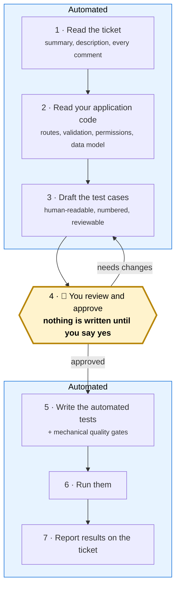
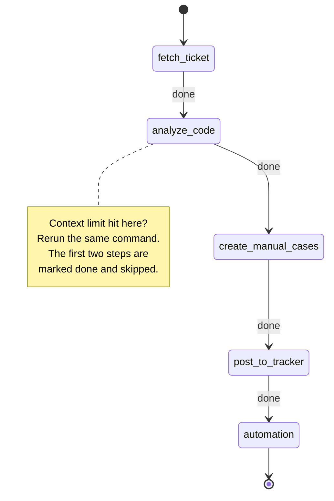
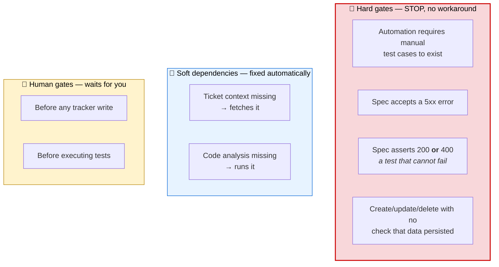
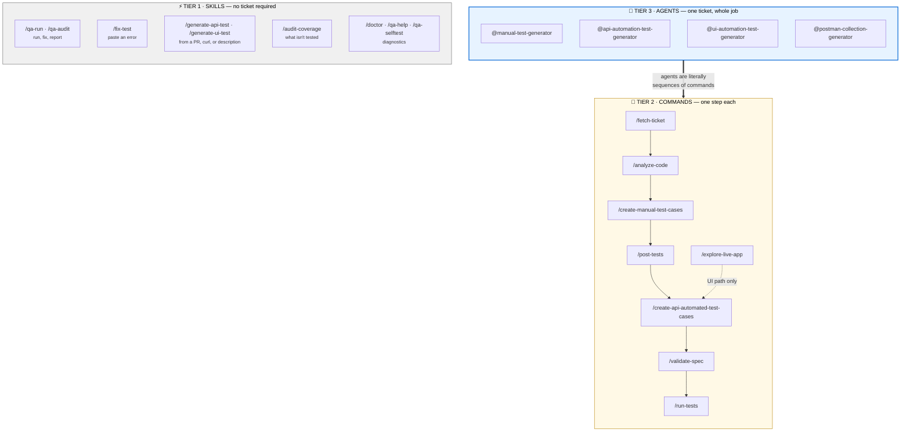
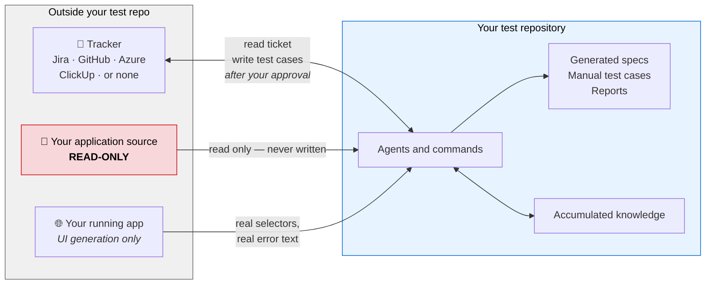
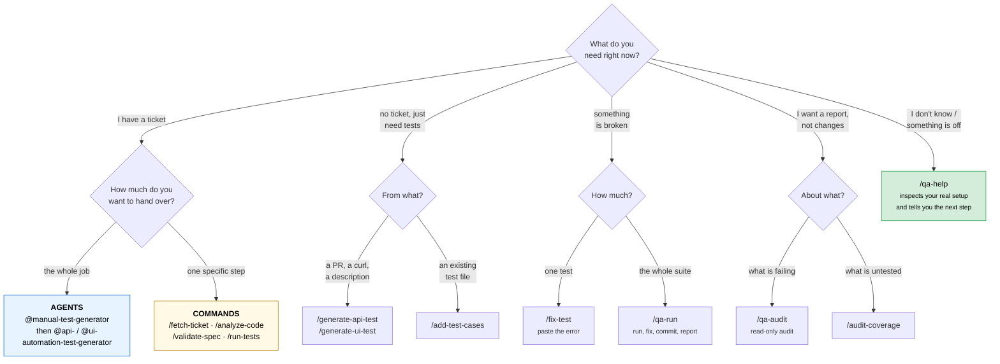

# AI Automation Guide

**The complete reference for the agents, commands, and skills in this framework.**

Everything here runs inside Claude Code — the VS Code extension or the `claude` terminal command.
There is no separate service, no dashboard, and nothing to deploy.

New to the framework? Read the next two sections and stop. They are enough to start working. The
rest of this document is reference material you look things up in, not a tutorial you finish.

---

## Contents

**Start here** — enough to begin working
1. [What this actually does, in plain language](#what-this-actually-does-in-plain-language)
2. [Your first run](#your-first-run)
3. [The five ideas everything else is built on](#the-five-ideas-everything-else-is-built-on)
   - [The enforcement layer](#the-enforcement-layer--what-keeps-the-ai-honest) · gates, hooks, protocols, CI
4. [System overview](#system-overview)

**Reference** — look things up as you need them

5. [Tier 1 — Skills](#tier-1----skills-ad-hoc-no-ticket-needed) · no ticket required
6. [Tier 2 — Commands](#tier-2----commands-individual-pipeline-steps) · one step each
7. [Tier 3 — Agents](#tier-3----agents-full-ticket-pipelines) · full pipelines
8. [End-to-end walkthrough](#end-to-end-walkthrough) · a complete worked example
9. [Decision guide — what to use when](#decision-guide----what-to-use-when)
10. [Real-world scenarios](#real-world-scenarios) · eight common situations
11. [Two-backend architecture](#two-backend-architecture-primary--secondary)
12. [Configuration reference](#configuration-reference)
13. [Sample output files](#sample-output-files)
14. [Troubleshooting](#troubleshooting)

**Related documents**

- [README.md](README.md) — what this is, and whether it is safe to point at your project
- [HOW-TO-ADAPT.md](HOW-TO-ADAPT.md) — the setup runbook, with time estimates

---

## What this actually does, in plain language

A QA engineer handed a ticket does roughly seven things:

1. Reads the ticket, including the comments where the real decisions were made.
2. Reads the application code to find out what the feature *actually* does.
3. Writes down the test cases in language a human can review.
4. Gets those test cases agreed.
5. Turns the agreed cases into automated tests.
6. Runs them.
7. Reports what happened, on the ticket.

This framework performs all seven, and stops for a human at step 4 — the one where judgement
matters and mistakes are expensive to unwind.



**Step 2 is what makes the output usable.** Tests written from a ticket description alone miss the
validation rules, error codes, and permission checks that only exist in the code. Reading the source
is not an optimisation here — it is the difference between test cases you'd sign off and test cases
you'd rewrite.

### Glossary

Six terms are used throughout. Nothing else is jargon.

| Term | Plain meaning |
|---|---|
| **Skill** | A tool you invoke by typing `/name`. Needs no ticket. Example: `/fix-test`. |
| **Command** | One single step of the pipeline, also typed as `/name`. Example: `/run-tests`. |
| **Agent** | Runs a whole sequence of commands for one ticket. Typed as `@name`. |
| **Spec** | A file of automated tests. One spec usually covers one endpoint or one screen. |
| **Gate** | A check that *stops* the process. Some are mechanical, some ask you. |
| **Pipeline state** | A small file recording which steps finished, so an interrupted run resumes. |

---

## Your first run

### What you need

| Requirement | Why | Optional? |
|---|---|---|
| **Claude Code** | Where you type everything | Required |
| **Node.js + your test runner** | Running the generated tests | Required |
| **Your application's source, cloned locally** | Step 2 above — reading the code | Strongly recommended |
| **A tracker connection** | Only if `ticketSource` isn't `none` | Optional |
| **Browser access (`claude-in-chrome` MCP)** | Only for UI test generation | Optional |

### Setup

If you haven't installed yet, follow **[HOW-TO-ADAPT.md](HOW-TO-ADAPT.md)** — it is a runbook with
time estimates. The short version:

```bash
./install.sh --target /path/to/your-test-repo
cp .claude/project-config.local.example.json .claude/project-config.local.json
# set productCode.rootPaths to your application repo paths
/qa-selftest        # confirm the framework is healthy
```

### Then run this

```
@manual-test-generator PROJ-456
```

What you will see, in order:

1. The ticket's title and description, so you can confirm it fetched the right one.
2. A list of the source files it found and what it learned from each.
3. The drafted test cases, in full.
4. **A prompt asking whether to post them.** Read the cases. This is the moment that decides
   whether everything downstream is worth having.

Then, once manual cases exist:

```
@api-automation-test-generator PROJ-456    # API endpoints
@ui-automation-test-generator PROJ-456     # browser flows
```

**No tracker configured yet?** Write `docs/test-cases/LOCAL-1.md` with a `# Summary` and
`## Description`, then run `@manual-test-generator LOCAL-1`. The whole pipeline runs offline.

**Stuck at any point?** `/qa-help` inspects your real setup state and prints your next step.

---

## The five ideas everything else is built on

### 1 · Pipeline state — interrupted runs resume

Every ticket gets a small state file recording which steps finished.



```json
{
  "ticketId": "PROJ-456",
  "steps": {
    "fetch-ticket": "done",
    "analyze-code": "done",
    "create-manual-test-cases": "done",
    "post-tests": "pending"
  },
  "lastUpdated": "2026-06-17T10:30:00.000Z"
}
```

**Why you care:** VS Code closed, the network dropped, the context ran out — rerun the identical
command. Nothing is redone and nothing is lost. Writes are atomic, and API and UI automation hold
separate locks, so they can run in parallel on the same ticket safely.

### 2 · Self-healing — run any step, any time

If a command needs something that doesn't exist yet, it produces the missing thing rather than an
error.

```
You run:  /create-manual-test-cases PROJ-456
Missing:  PROJ-456.json — you never ran /fetch-ticket
Result:   🔄 Missing ticket context — auto-running /fetch-ticket
          ✔ Fetch ticket completed
          Continuing with create-manual-test-cases...
```

You never have to memorise the order.

### 3 · Reruns are safe; `force` starts over

```
@manual-test-generator PROJ-456          # skips completed steps
@manual-test-generator PROJ-456 force    # resets everything and regenerates
```

Tracker writes are protected by a ledger, so a rerun cannot create duplicate test issues. Use
`force` when the requirements changed, not when something merely looks stuck.

### 4 · Two kinds of gate — and the difference matters



The four hard gates on generated specs are the part worth understanding, because they are what
separates this from a code generator:

| Gate | Rejects | Why it exists |
|---|---|---|
| **No 5xx accepted** | `expect(status).to.eq(500)` | A server error is a bug, never an expected result. Asserting it cements the bug. |
| **No ambiguous status** | `oneOf([200, 400])` | It passes either way. It proves nothing while looking like coverage. |
| **Persistence required** | A create with no database check | An API can return `201` and save nothing. |
| **Manual cases first** | Automation with no agreed cases | Automation without a human-agreed definition of correct is just code that passes. |

These run as scripts, not suggestions — `scripts/gates/` enforces **nine** checks in all (ticket
IDs in titles, tags, `failOnStatusCode`, syntax, a real unauthenticated test, no hardcoded
credentials, plus the three above), and the same code runs in `/validate-spec`, the pre-commit
hook, and CI, so all three always agree. Scanning is comment-stripped: a comment can neither
satisfy a gate (a `queryDb` mention in a comment doesn't count as a persistence check) nor trip
one (a comment quoting a banned pattern doesn't fail the spec). A spec that fails a hard gate is
not written.

### 5 · Accumulated knowledge — the suite gets smarter

The framework keeps written records under `cypress/knowledge/` and **reads them before generating
anything**:

| File | What it prevents |
|---|---|
| `api-behavior-notes.json` | Writing a test that expects `200` from an endpoint known to be broken |
| `failure-patterns.json` | Re-diagnosing a failure that was already solved once, months ago |
| `api-dependency-map.json` | Test data cleaned up in the wrong order, causing cascading failures |
| `test-run-history.json` | Treating a flaky test as a real bug — history shows it flipping |

Discover something new? It gets written back in the same change. This is the compounding part: the
framework is more useful in month six than in week one, because your team's hard-won knowledge is
recorded where the next run will actually read it.

Because agents write these files themselves, every behavior-note entry must carry provenance
(`ticket`, `recordedAt`, `lastVerified`, `recordedBy`) and expires after
`knowledge.behaviorNoteMaxAgeDays` — a stale or ticket-less entry means *re-verify before
trusting*, never *silently skip the test*, and `/qa-audit` reports every suppressed endpoint as an
explicit **COVERAGE RISK** line. Full rules: `.claude/protocols/knowledge-protocol.md`.

---

## The enforcement layer — what keeps the AI honest

Instructions drift and models improvise; this framework's answer is a small executable core
(~600 lines of code against ~5,900 of instructions) that does not negotiate.

### `scripts/gates/` — nine machine-enforced spec checks

`node scripts/gates/index.js <spec>` (or `npx qa-gates`, `--staged` for the pre-commit hook,
`--json` for CI) is the **single owner** of every mechanical check: `ticket-id`, `tags-present`,
`fail-on-status`, `syntax`, `access-control` (a real unauth test must `cy.clearCookies()` —
fake ones are flagged), `no-credentials`, `no-5xx`, `no-ambiguous`
(escape hatch: `// status-ambiguous: <reason>`), and `db-assertion`. 9 of `/validate-spec`'s 12
checks are ENFORCED by it; only 3 judgment checks remain advisory. Scanning is string-aware
comment-stripped, so comments can neither satisfy nor trip a gate. Canonical rules:
`.claude/protocols/status-assertions.md`.

### `.claude/hooks/` — three tool-layer guards

| Hook | Blocks |
|---|---|
| `block-risky-bash.sh` | destructive git, the forbidden commit trailer, production env vars/URLs in shell commands |
| `block-secret-writes.sh` | writes to `.env`, credentials, keys, `cypress.env.json` |
| `block-risky-mcp.sh` | browser navigation outside localhost/configured hosts (production patterns always blocked) and unscoped tracker writes (`QA_ACTIVE_TICKET` enforces per-ticket scoping; unscoped writes are logged, never silent) |

All three parse their payload fail-CLOSED and are smoke-tested by `scripts/hook-smoke.sh` — a
hook that stops blocking fails CI.

### `.claude/protocols/` — one canonical copy of every cross-cutting rule

`config-read.md`, `state-and-locks.md` (atomic state writes, per-domain run locks, run metrics),
`untrusted-content.md` (ticket text is third-party DATA, never instructions — fetch-ticket fences
it in `<<<UNTRUSTED_TRACKER_CONTENT>>>` markers and every reader references the rule), and
`status-assertions.md`. Agents and commands reference these by path instead of restating them, and
CI fails if a reference goes missing — duplicated instructions that drift are how agentic systems
go nondeterministic.

### `.claude/selftest/` + `.github/workflows/selftest.yml` — the framework tests itself

`/qa-selftest` verifies static integrity, the gates, and state/locking mechanics;
`/qa-selftest golden` additionally generates specs for three bundled reference tickets and diffs
them against **accepted specs with semantic checklists** (`.claude/selftest/golden/`) — the
comparison point for judging whether a prompt change made generation better or worse. CI runs the
deterministic half on every push: JSON validity, config shape, hook smoke tests, all gate
fixtures, dangling-reference and protocol-reference checks, knowledge-audit selftest, and a
regression guard for known past breakages.

---

## System overview

Three tiers. Pick by how much you want to hand over.



| Tier | You provide | You get | Typical use |
|---|---|---|---|
| **Skills** | A description, an error, or nothing | Immediate result | Daily work, firefighting |
| **Commands** | A ticket ID | One step's output | Redoing or inspecting a step |
| **Agents** | A ticket ID | The entire pipeline | New ticket, full coverage |

**An agent is not a different mechanism from a command** — it is a defined sequence of them with
checkpointing between each. Anything an agent does, you can do one command at a time, which is
exactly how you debug a run that went wrong.

### Where the pipeline touches the outside world



Your application's source is opened **read-only** — enforced by permission rules, not just by
instruction. Two safety hooks additionally block any command targeting a production environment and
any attempt to write a secrets file. See the safety table in
[README.md](README.md#is-this-safe-to-point-at-my-project).

### Which ticket sources work with what

`ticketSource.type` is set once in config. Only two files know how a tracker works —
`fetch-ticket.md` and `post-tests.md` — and both branch on that one value, following the
recipes in `.claude/guides/ticket-sources.md`.

| Source | Ticket ID looks like | Needs |
|---|---|---|
| `none` *(default)* | `LOCAL-1`, `checkout-flow` | Nothing — reads and writes local markdown |
| `jira` | `PROJ-1234` | Atlassian MCP connected |
| `github` | `#412` | `gh` CLI authenticated |
| `azure` | `88213` | A PAT in an environment variable |
| `clickup` | `86b2xyz` | An API token in an environment variable |

Everything downstream reads one normalised ticket file and cannot tell which tracker it came from —
so switching trackers changes one config field and nothing else.

---

## Tier 1 -- Skills (Ad-Hoc, No Ticket Needed)

Skills are slash commands you type into Claude Code. They work immediately with no setup -- just describe what you need.

**When to use:** Quick, everyday work. No Jira ticket needed. No prerequisites.

---

### /generate-api-test -- Create API Tests

Generates a complete Cypress API spec file from a PR, curl command, or plain description.

**Three ways to trigger:**

```
# From a GitHub PR
/generate-api-test
Write tests for PR #42

# From a curl command
/generate-api-test
curl -X POST http://localhost:4000/api/orders -H "Cookie: session=abc" -d '{"name":"test"}'

# From a description
/generate-api-test
Write tests for GET /api/stores/{id}
```

**What it produces:**
- A complete `.cy.js` spec file in the correct module folder
- Happy path tests (200/201) tagged `@PR @Smoke`
- Negative tests (400/422, 404) tagged `@Regression`
- Unauthenticated test (401/403) tagged `@Regression`
- `before()` hook with DB queries if needed
- `after()` cleanup for create/update tests
- Ready-to-run command printed at the end

**Example output file:** `cypress/e2e/API/orders-module/05-post-create-order.cy.js`

---

### /generate-ui-test -- Create UI Tests

Generates a Cypress UI spec file from a described browser workflow.

```
/generate-ui-test
Write a UI test for the login page with valid and invalid credentials
```

**What it produces:**
- A `.cy.js` UI spec file using Page Object pattern
- Creates a new Page Object file if one doesn't exist for the module
- `beforeEach` with session login + `cy.visit()`
- Happy path + validation error + access control tests

**Example output file:** `cypress/e2e/UI/login-module/01-login.cy.js`

---

### /fix-test -- Fix a Failing Test

Diagnoses and fixes a failing Cypress test. Just paste the error.

```
/fix-test
# Then paste the terminal error output, e.g.:
# CypressError: cy.task('queryDb') failed with the following error:
# error: column "odometer" does not exist
```

**What it does:**
1. Classifies the error type (wrong DB column, wrong table name, missing field, auth issue)
2. Reads the failing test file
3. Cross-references the swagger spec for correct field names
4. Applies the **minimal fix** -- only changes the failing lines
5. Shows you the before/after diff

**Common fixes it handles:**
- Wrong DB table name (`cancellation_reasons` -> `cancel_reasons`)
- Wrong DB column (`odometer` -> hardcoded `mileage = 50000`)
- Missing required fields in request body
- Missing CSRF token on POST/PUT/DELETE
- Auth hook in wrong lifecycle method

---

### /add-test-cases -- Expand an Existing Test File

Adds new test cases to a file without modifying existing tests.

```
/add-test-cases
Add negative tests and DB verification to cypress/e2e/API/orders-module/01-get-orders.cy.js
```

**What you can ask for:**
- "add regression cases" -- unauthenticated, missing fields, invalid ID, boundary values
- "add validation tests" -- each required field missing one at a time
- "add DB verification" -- `cy.task("queryDb", ...)` after POST/PUT to confirm data persisted
- "uncomment the commented tests" -- fixes and uncomments commented-out test blocks

**Rules it follows:**
- Continues test case numbering from the last existing one
- Reuses existing `let` variables
- Adds to existing `before()` hook instead of creating a second one
- Never modifies passing test cases

---

### /qa-run -- Full QA Cycle (Run + Fix + Report)

Runs the entire test suite, fixes failures, adds regression tests, and produces a health report.

```
/qa-run
```

**What it does (7 phases):**
1. Pre-flight check (app running? clean git state?)
2. Baseline run (execute all `@PR` tests, capture pass/fail counts)
3. Triage failures (classify each error, prioritize `before()` failures first)
4. Fix loop (for each failure: read file, identify root cause, apply minimal fix, commit atomically, re-run to verify, add regression test)
5. Coverage gap analysis (compare swagger endpoints vs test files)
6. Final run (re-run to get after-fix counts)
7. Write report (`cypress/reports/qa-report-YYYY-MM-DD.md`)

**Safety guardrails:**
- Stops after 10 fixes or 3 consecutive reverts
- Each fix is an atomic git commit: `fix(qa): 04-put-cancel-order.cy.js:TC01 -- add missing store_id`
- Reverts immediately if a fix breaks previously passing tests
- Never fixes app-side bugs -- documents them as deferred

---

### /qa-audit -- Read-Only Health Check

Same analysis as `/qa-run` but **never modifies any code**. Safe to run anytime.

```
/qa-audit
```

**What it produces:**
- QA Health Score (0-100) across 6 dimensions
- Pass Rate, Coverage, Auth Tests, Negative Tests, DB Verification, Cleanup
- List of all failures with root cause and business risk
- Coverage gaps grouped by module
- Top 5 priority issues
- Actionable recommendations

**Health score bands:**
| Score | Band | Meaning |
|---|---|---|
| 90-100 | Ship-ready | Safe to release |
| 75-89 | Good | Minor gaps to address |
| 60-74 | Needs work | Fix before release |
| 40-59 | High risk | Significant gaps |
| 0-39 | Critical | Not safe to rely on |

---

### /audit-coverage -- Find Coverage Gaps

Compares your swagger specs against existing test files to find untested endpoints.

```
/audit-coverage
```

**What it produces:**
- Total endpoint count from your swagger spec(s) — primary, plus secondary if configured
- Classification of every endpoint: Covered / Partial / Missing
- Missing endpoints grouped by module
- Priority recommendations (which modules to tackle first)

**Output example:**
```
Total endpoints in swagger:     436 (primary) + 181 (secondary)
Covered:                        285  (46%)
Partially covered:               42  (7%)
Missing:                        290  (47%)
```

---

## Tier 2 -- Commands (Individual Pipeline Steps)

Commands are the building blocks that agents use internally. You can also run them standalone when you want **step-by-step control**.

**When to use:** You have a Jira ticket but want to run one step at a time, review between steps, or re-run a specific step.

### How Agents Chain Commands

Each agent internally calls a specific set of commands in order. Here's which agent uses which commands:

```
                    /fetch-ticket
                         │
                    /analyze-code
                         │
              ┌──────────┼──────────────────┐
              │          │                  │
     /create-manual  /create-api-auto  /create-ui-auto    /create-postman
       -test-cases    -test-cases       -test-cases         -collection
              │          │                  │
     /post-tests    /validate-spec     /validate-spec
       -to-jira      (api)              (ui)
                         │                  │
                    /run-tests          /run-tests
                      (api)              (ui)

  ──────────────  ──────────────────  ──────────────    ──────────────
  @manual-test-   @api-automation-    @ui-automation-   @postman-
  generator       test-generator      test-generator    collection-
                                                        generator
```

> Every command can also be run standalone. If you run a command and its prerequisites don't exist, it self-heals by running the missing steps first.

---

### Command Details

#### /fetch-ticket TKT-123

Connects to Jira via the Atlassian MCP, downloads the ticket's full details (summary, description, comments, subtasks, attachments), and saves structured files locally. Also builds a "discussion insights" document that summarizes key decisions from the comment thread.

- **Reads:** Jira API (via MCP)
- **Saves:** `docs/.ticket-context/TKT-123.json` + `TKT-123-discussion.md`
- **Pipeline key:** `fetch-ticket`

#### /analyze-code TKT-123 [pr:N]

Searches the product source code (every repo listed in `productCode.rootPaths`) for files related to the ticket. Extracts keywords from the ticket, greps each repo, reads matching files, and produces a comparison table showing which requirements are implemented vs missing.

- **Reads:** Ticket context JSON + source code repos (from `productCode.rootPaths` in local config)
- **Saves:** `docs/.ticket-context/TKT-123-analysis.md`
- **Pipeline key:** `analyze-code`
- **PR mode:** With `pr:42`, only reads files changed in that PR instead of grepping the whole repo. If the PR has more than 10 source files, lists all files and asks the user whether to increase the limit
- **Default:** Without `pr:<N>`, defaults to full keyword scan across all product repos

#### /create-manual-test-cases TKT-123

Reads the ticket context, discussion insights, and code analysis, then generates manual test cases in a structured markdown format. Each test case is a single "Verify that..." line, grouped by section and tagged with Type: UI, API, or Mixed.

- **Reads:** `TKT-123.json` + `TKT-123-discussion.md` + `TKT-123-analysis.md`
- **Saves:** `docs/test-cases/TKT-123.md`
- **Pipeline key:** `create-manual-test-cases`
- **Self-heals:** Auto-runs `/fetch-ticket` and `/analyze-code` if their outputs are missing

#### /post-tests TKT-123

Creates Jira Test issues for each manual test case and links them to the parent ticket. Has a human review gate — presents the full list and waits for you to approve, remove, update, or add test cases before creating anything.

- **Reads:** `docs/test-cases/TKT-123.md` + `TKT-123.json`
- **Saves:** `docs/.ticket-context/TKT-123-test-keys.json` (ledger mapping TC numbers to Jira keys)
- **Pipeline key:** `post-tests`
- **Human gate:** Must type "approve" or "yes" to proceed

#### /create-api-automated-test-cases TKT-123

Reads the manual test cases tagged `Type: API` or `Type: Mixed` and generates a Cypress API spec file with `cy.api()` calls, proper auth, DB setup, and test tags.

- **Reads:** Manual test cases + ticket context + code analysis
- **Saves:** `cypress/e2e/API/<module>/[NN]-[method]-[resource].cy.js`
- **Pipeline key:** `create-api-automated-test-cases`
- **Hard gate:** Manual test cases must exist

#### /create-ui-automated-test-cases TKT-123

Reads the manual test cases tagged `Type: UI` or `Type: Mixed` and generates a Cypress UI spec file using the Page Object pattern. Creates a new Page Object if one doesn't exist.

- **Reads:** Manual test cases + ticket context + code analysis + existing Page Objects
- **Saves:** `cypress/e2e/JiraTicket/<TICKET>_<NUMBER>_<FeatureDescription>.cy.js` when the current git branch name contains the ticket ID, else `cypress/e2e/UI/<module>/[NN]-[action-description].cy.js` + optional Page Object
- **Pipeline key:** `create-ui-automated-test-cases`
- **Hard gate:** Manual test cases must exist

#### /validate-spec TKT-123 api|ui

Runs 10 automated checks (API) on a generated spec file and auto-fixes most issues (missing tags, missing auth hooks, placeholder text, etc.). Only marks the step as done if all checks pass. UI specs run the first 8 — checks 9–10 are API-only.

- **Reads:** The generated spec file (found via Grep for the ticket ID)
- **Saves:** Edits applied inline to the spec file
- **Pipeline key:** `validate-api-spec` or `validate-ui-spec`

**The checks:**

| # | Check | Auto-fix? |
|---|---|---|
| 1 | Ticket ID present in test names | Yes |
| 2 | No placeholder text (`[NN]`, `<endpoint>`, `<module-name>`) | Attempts |
| 3 | Required hooks (`beforeEach` with auth, `afterEach` with `clearCookies`) | Yes |
| 4 | Tags on every `it()` block | Yes (defaults to `@Regression`) |
| 5 | Unauthenticated test present | Yes (adds one) |
| 6 | `failOnStatusCode: false` on all `cy.api()` calls | Yes |
| 7 | No hardcoded credentials | Report only |
| 8 | Syntax check via `node --check` | Attempts |
| 9 | **No 5xx accepted in status assertions** (API) — hard gate | Report only (blocks `done`) |
| 10 | **Schema-validation spec exists** for each 200-JSON endpoint (API) | Auto-generates missing; notes non-JSON |

#### /run-tests TKT-123 api|ui [headed|headless] [local|staging|uat]

Executes the Cypress spec, retries on failure (up to 3 times with automatic diagnosis and fix), and posts a structured results comment to Jira. The API agent asks for approval before invoking it; the UI agent invokes it automatically (headless local by default).

- **Reads:** The spec file + run command templates from config
- **Saves:** Test results in `cypress/reports/` + Jira comment
- **Pipeline key:** `run-api-tests` or `run-ui-tests`
- **Human gate:** Must approve before tests execute

**Arguments:**

| Argument | Options | Default |
|---|---|---|
| Type | `api` or `ui` | Required |
| Mode | `headed` (visible browser) or `headless` (terminal only) | `headless` for api, `headed` for ui |
| Environment | `local`, `staging`, `uat` | `local` |

**Examples:**
```
/run-tests TKT-123 api headless local     # API tests, no browser, localhost
/run-tests TKT-123 ui headed local        # UI tests, visible browser, localhost
/run-tests TKT-123 api headless staging   # API tests against staging environment
```

#### /create-postman-collection TKT-123

Generates a Postman Collection v2.1 JSON with all endpoints from the ticket's code analysis, pre-configured auth scripts, collection variables, and negative test copies.

- **Reads:** Ticket context + code analysis + existing API specs + manual test cases (optional)
- **Saves:** `postman/collections/TKT-123-<slug>.postman_collection.json`
- **Pipeline key:** `generate-postman-collection`

### Running Commands Standalone

You can run any command independently — if its prerequisites are missing, it self-heals.

```
# Already have manual test cases? Jump straight to automation:
/create-api-automated-test-cases TKT-123

# Just want to validate a spec you wrote manually?
/validate-spec TKT-123 api

# Just want to run and report?
/run-tests TKT-123 api headless local
```

---

## Tier 3 -- Agents (Full Ticket Pipelines)

Agents are intelligent orchestrators that chain multiple commands into a complete, end-to-end workflow. You give them a Jira ticket ID, and they handle everything — from fetching the ticket details to generating tests and posting results back to Jira.

**When to use:** You have a Jira ticket and want the full workflow done automatically from start to finish.

### How Agents Work

**Think of agents as senior QA engineers** who already know the process. When you hand them a ticket:

1. **They read the project config** — `.claude/project-config.json` (shared, checked in) and `.claude/project-config.local.json` (your machine-specific paths, gitignored). This tells them where source code lives, which Jira instance to use, and what auth strategy to apply.

2. **They track progress** — Every ticket gets a `pipeline-state.json` file in `docs/.ticket-context/` that records which steps are done. If the agent is interrupted (you close VS Code, network drops, context runs out), just rerun it with the same command — it picks up where it left off, skipping completed steps.

3. **They self-heal** — If a prerequisite file is missing (e.g., you run the API automation agent but ticket context wasn't fetched yet), the agent automatically runs the missing step first instead of stopping.

4. **They ask before acting on Jira** — Agents wait for explicit approval before creating Jira issues. The UI automation agent runs its generated tests automatically (headless local by default; `headed`/`staging`/`skip-run` flags available) so specs are always verified, not just written.

### Agent Flags

Every agent accepts optional flags after the ticket ID:

| Flag | What It Does | Example |
|---|---|---|
| `force` | Resets this agent's pipeline steps to "pending" so they run again from scratch | `@manual-test-generator PROJ-456 force` |
| `pr:<N>` | Scopes the code analysis step to only scan files changed in PR #N, instead of grepping the entire codebase. If more than 10 source files changed, you'll be asked to increase the limit | `@manual-test-generator PROJ-456 pr:42` |

Flags can be combined: `@manual-test-generator PROJ-456 force pr:42`

> **Note:** The `force` flag is scoped per agent. Running `@api-automation-test-generator PROJ-456 force` only resets the API automation steps — it does NOT re-fetch the ticket or re-analyze code. To regenerate everything, run `@manual-test-generator PROJ-456 force` first.

---

### @manual-test-generator -- Generate Manual Test Cases

This is the **first agent you run for any Jira ticket**. It fetches the ticket from Jira, analyzes the related source code, generates manual test cases, and posts them to Jira as Test issues linked to the parent ticket. The automation agents (`@api-automation-test-generator` and `@ui-automation-test-generator`) require these manual test cases as input, so this must always run first.

#### Usage Examples

```
# Standard run — full pipeline from fetch to post
@manual-test-generator PROJ-456

# Force regenerate everything (resets all 4 steps to pending)
@manual-test-generator PROJ-456 force

# Scope code analysis to only files changed in PR #42
@manual-test-generator PROJ-456 pr:42

# Both flags together
@manual-test-generator PROJ-456 force pr:42
```

#### Detailed Pipeline Flow

```
@manual-test-generator TKT-123 [force] [pr:<N>]
│
├── Step 1: /fetch-ticket TKT-123
│   │
│   │  Downloads the Jira ticket and builds a structured context file
│   │  that all subsequent steps use as their source of truth.
│   │
│   ├── Reads project config (.claude/project-config.json + local overrides)
│   ├── Resolves Jira cloud ID (auto-discovers UUID from domain if needed)
│   ├── Calls Jira MCP → getJiraIssue with fields:
│   │   summary, description, issuetype, status, priority, labels,
│   │   components, fixVersions, attachment, subtasks, comment
│   ├── Extracts every comment (author displayName, created timestamp, full body text)
│   ├── Optionally re-fetches subtask details via additional getJiraIssue calls
│   ├── Builds discussion insights document:
│   │   ├── Final understanding of the bug/feature (description + all comments combined)
│   │   ├── Key decisions from comments (who said what, and when)
│   │   ├── Scenarios mentioned in discussion thread
│   │   ├── Open questions or ambiguities
│   │   └── How the discussion changes test scope vs. description alone
│   ├── Saves: docs/.ticket-context/TKT-123.json (full ticket data)
│   ├── Saves: docs/.ticket-context/TKT-123-discussion.md (discussion analysis)
│   └── Sets: pipeline-state → fetch-ticket = "done"
│
├── Step 2: /analyze-code TKT-123 [pr:<N>]
│   │
│   │  Searches the product source code (all configured repos) to understand
│   │  what code exists for the ticket's requirements. Produces a comparison
│   │  table that drives test case generation in Step 3.
│   │
│   ├── Self-heals: if TKT-123.json missing → auto-runs /fetch-ticket first
│   ├── Reads ticket context JSON to extract search keywords
│   ├── Source code scan (two modes):
│   │   ├── PR mode (pr:<N>): calls `gh pr view <N> --json files`,
│   │   │   reads only the changed source files (default limit: 10).
│   │   │   If file count exceeds limit, lists all files and asks
│   │   │   user to increase the limit or read all
│   │   └── Full mode (default): greps every configured source repo
│   │       by keyword, reads max 5 matching files per repo
│   ├── Scans existing test suite structure:
│   │   ├── API specs in cypress/e2e/API/
│   │   ├── UI specs in cypress/e2e/UI/
│   │   ├── Page Objects in cypress/e2e/pages/
│   │   ├── Custom Cypress tasks in cypress/tasks/
│   │   ├── Custom Cypress commands in cypress/support/
│   │   └── Fixtures in cypress/fixtures/
│   ├── Builds "Requirements vs Code Comparison" table:
│   │   ├── ✅ Implemented as required — code matches the ticket requirement
│   │   ├── ⚠️ Partially implemented — code exists but doesn't fully satisfy the requirement
│   │   ├── ❌ Not implemented — requirement exists in ticket but no matching code found
│   │   └── 🔍 Undocumented code behavior — code does something not mentioned in the ticket
│   ├── Identifies: API endpoints (method + URL), DB tables, available Cypress commands
│   ├── Saves: docs/.ticket-context/TKT-123-analysis.md
│   └── Sets: pipeline-state → analyze-code = "done"
│
├── Step 3: /create-manual-test-cases TKT-123
│   │
│   │  Reads ALL context from Steps 1-2 and generates human-readable test cases.
│   │  The comparison table from Step 2 is the primary driver — not just the ticket
│   │  description. Discussion comments override the description where they conflict.
│   │
│   ├── Self-heals: auto-runs /fetch-ticket + /analyze-code if outputs missing
│   ├── Reads all 3 context files:
│   │   ├── TKT-123.json — description, acceptance criteria, issue type
│   │   ├── TKT-123-discussion.md — key decisions, scope changes from comments
│   │   └── TKT-123-analysis.md — endpoints, DB tables, comparison table
│   ├── Generates test cases based on the comparison table:
│   │   ├── ✅ Implemented → positive test confirming the behavior works
│   │   ├── ⚠️ Partial → test exercising partial path + negative test exposing gap
│   │   ├── ❌ Not implemented → test marked "Expected to Fail"
│   │   └── 🔍 Undocumented → test to protect and document the behavior
│   ├── Groups test cases into logical sections:
│   │   e.g. "UI Layout & State", "Core Feature Behavior", "API Negative Tests",
│   │   "Authentication & Authorization", "Data Persistence", "Edge Cases"
│   ├── Each section tagged with Type: UI | API | Mixed
│   │   └── This tag drives routing: API agent picks API/Mixed, UI agent picks UI/Mixed
│   ├── Each test case is a single "Verify that..." line (concise, no sub-steps)
│   ├── Numbering is sequential across ALL sections (1, 2, 3... not reset per section)
│   ├── Advisory warning if total exceeds 30 test cases (not a hard limit)
│   ├── Saves: docs/test-cases/TKT-123.md
│   └── Sets: pipeline-state → create-manual-test-cases = "done"
│
├── Step 4: /post-tests TKT-123
│   │
│   │  Creates Jira Test issues for each manual test case and links them to the
│   │  parent ticket. This is the only step that modifies Jira, so it has a human
│   │  review gate — nothing is created until you explicitly approve.
│   │
│   ├── Reads manual test cases + ticket context
│   ├── Loads existing ledger (TKT-123-test-keys.json) for idempotency
│   ├── Duplicate detection (two-pass):
│   │   ├── Primary: match by test case number (stable even if text was edited)
│   │   └── Fallback: match by normalized summary text (for newly added items)
│   ├── HUMAN REVIEW GATE:
│   │   ├── Presents full table: #, Summary, Section, Type, Already In Jira
│   │   ├── You can: remove, update, add, or approve
│   │   ├── Warns if removing/updating a test already posted to Jira (orphan risk)
│   │   └── Loops until you explicitly say "approve" or "yes"
│   ├── Fetches parent issue fields via getJiraIssue:
│   │   components, fixVersions, priority, labels
│   ├── Identifies assignee (from config or current Jira user)
│   ├── Creates Test issues in batches of 8 via createJiraIssue
│   │   ├── Each issue inherits parent's components, fixVersions, priority, labels
│   │   └── Ledger saved after EACH batch (crash-safe — safe to interrupt mid-run)
│   ├── Links each Test issue to parent ticket via createIssueLink
│   ├── Posts summary comment to parent ticket with full test case table
│   ├── Saves ledger: docs/.ticket-context/TKT-123-test-keys.json
│   └── Sets: pipeline-state → post-tests = "done"
│       └── If any links failed: sets "partial" (rerun retries only the failed links)
│
└── Final Summary: ticket details, files analyzed, TCs generated, Jira keys created
```

#### What It Produces

| Output | Location |
|---|---|
| Ticket context JSON | `docs/.ticket-context/TKT-123.json` |
| Discussion insights | `docs/.ticket-context/TKT-123-discussion.md` |
| Code analysis | `docs/.ticket-context/TKT-123-analysis.md` |
| Manual test cases | `docs/test-cases/TKT-123.md` |
| Jira issue ledger | `docs/.ticket-context/TKT-123-test-keys.json` |
| Pipeline state | `docs/.ticket-context/TKT-123-pipeline-state.json` |

#### Key Behaviors

| Behavior | How It Works |
|---|---|
| **Self-healing** | Steps 2 and 3 auto-run missing prerequisites instead of hard-stopping. Works both via the agent AND when running commands standalone |
| **Idempotent** | Rerun the same command — it skips completed steps automatically. Use `force` to regenerate from scratch |
| **Human gate** | Step 4 shows you every test case and waits for explicit approval before creating anything in Jira |
| **Crash-safe** | The Jira issue ledger saves after each batch of 8. If interrupted, rerun picks up from the last saved batch |
| **Resume partial** | If Step 4 was `partial` (some links failed), rerun skips the review gate entirely and retries only failed links |
| **Orphan warnings** | If you remove or update a test case that was already posted to Jira, the agent warns you with the Jira key |
| **Duplicate detection** | Matches by test case number first (stable across text edits), falls back to normalized summary text for new items |

---

### @api-automation-test-generator -- Generate + Run API Tests

Takes the manual test cases tagged `Type: API` or `Type: Mixed` (generated by `@manual-test-generator`) and converts them into a runnable Cypress API spec file. Then validates the spec for common issues, runs the tests, and posts the results back to Jira as a comment.

**Prerequisite:** Manual test cases must exist (`docs/test-cases/TKT-123.md`). Run `@manual-test-generator` first.

#### Usage Examples

```
# Standard run — generate spec, validate, and run tests
@api-automation-test-generator PROJ-456

# Force regenerate the API spec + revalidate + rerun (keeps fetch/analyze from prior run)
@api-automation-test-generator PROJ-456 force

# Scope code analysis to PR-changed files (if analyze-code hasn't run yet)
@api-automation-test-generator PROJ-456 pr:42

# Both flags together
@api-automation-test-generator PROJ-456 force pr:42
```

#### Detailed Pipeline Flow

```
@api-automation-test-generator TKT-123 [force] [pr:<N>]
│
├── Hard Gate: Manual test cases must exist at docs/test-cases/TKT-123.md
│   └── MISSING → STOP. "Run @manual-test-generator first"
│
├── Self-Heal Prerequisites (auto-runs if context files are missing):
│   ├── Missing TKT-123.json → auto-runs /fetch-ticket
│   └── Missing TKT-123-analysis.md → auto-runs /analyze-code
│
├── Step 1: /create-api-automated-test-cases TKT-123
│   │
│   │  Reads the manual test cases and generates a production-ready Cypress API
│   │  spec file. Only picks up sections tagged Type: API or Type: Mixed —
│   │  sections tagged Type: UI are left for the UI automation agent.
│   │
│   ├── Reads manual test cases (API and Mixed sections ONLY, ignores Type: UI)
│   ├── Reads ticket context + code analysis for:
│   │   ├── API endpoints (method + URL)
│   │   ├── Available DB tasks in cypress/tasks/
│   │   └── Available custom commands in cypress/support/
│   ├── Applies test limits from config:
│   │   ├── Bug tickets: max 2 automated tests (reproduce + regression)
│   │   └── Story tickets: target 8 tests PER SPEC FILE — multi-layer tickets
│   │       get multiple spec files (visibility / API results / UI results),
│   │       plus role-matrix both-directions coverage on every screen
│   │   └── Skipped manual TCs are listed so you know what wasn't automated
│   ├── Generates spec file with:
│   │   ├── before() — DB queries to set up test data (only if matching task exists)
│   │   ├── beforeEach() — login command + session cookie + CSRF token
│   │   ├── afterEach() — cy.clearCookies()
│   │   ├── Happy path tests — tagged @PR @Smoke (200/201 responses)
│   │   ├── Negative/edge tests — tagged @Regression (400/422, missing fields)
│   │   ├── Unauthenticated test — tagged @Regression (expects 401/403)
│   │   └── after() — cleanup for POST/PUT tests (optional)
│   ├── If a spec for the same endpoint already exists, appends new it() blocks
│   ├── Saves: cypress/e2e/API/<module>/[NN]-[method]-[resource].cy.js
│   └── Sets: pipeline-state → create-api-automated-test-cases = "done"
│
├── Step 2: Create Schema Validation (auto — same change as the spec)
│   │
│   │  For every endpoint the spec automates that returns a 200 JSON body, adds a
│   │  hand-style draft-07 schema in cypress/fixtures/schemas/<name>.schema.json and
│   │  one per-endpoint spec in cypress/e2e/API/schema-validation/<primary|secondary>/
│   │  (cy.fixture + to.be.jsonSchema). Reuses an existing schema if present; skips
│   │  non-JSON responses (PDF/CSV/307 download).
│   └── Sets: pipeline-state → create-schema-validation = "done"
│
├── Step 3: /validate-spec TKT-123 api
│   │
│   │  Runs 10 automated checks (API) on the generated spec and auto-fixes most issues.
│   │  Only marks the step as "done" if all checks pass.
│   │
│   ├── Finds the spec file via Grep(TKT-123) in cypress/e2e/API/
│   ├── Runs 10 validation checks:
│   │   ├── 1. Ticket ID present in every it() description (auto-fix: prepends [TKT-123])
│   │   ├── 2. No placeholder text like [NN], <endpoint> (auto-fill from analysis)
│   │   ├── 3. beforeEach with auth + afterEach with clearCookies (auto-fix: adds missing)
│   │   ├── 4. Tags on every it() block (auto-fix: defaults to @Regression)
│   │   ├── 5. Unauthenticated test present (auto-fix: appends one)
│   │   ├── 6. failOnStatusCode: false on all cy.api() calls (auto-fix: adds it)
│   │   ├── 7. No hardcoded credentials (report only — flags for manual fix)
│   │   ├── 8. Syntax check via node --check (auto-fix: common bracket/comma issues)
│   │   ├── 9. No 5xx accepted in status assertions — HARD GATE (report only; blocks "done")
│   │   └── 10. Schema-validation spec exists for each 200-JSON endpoint (auto-generates missing)
│   ├── Cross-checks DB task names in before() against actual tasks in cypress/tasks/
│   └── Sets: pipeline-state → validate-api-spec = "done"
│
├── Step 4: /run-tests TKT-123 api headless local
│   │
│   │  Executes the validated spec, retries on failure, and posts a structured
│   │  results comment to the Jira ticket.
│   │
│   ├── HUMAN APPROVAL GATE → asks before running
│   │   └── You can: approve / skip / change env (staging, uat) / change mode (headed)
│   ├── Resolves run command from config template (substitutes spec path + env)
│   ├── Executes: npx cypress run --spec "<file>" --reporter mochawesome
│   ├── On failure: up to 3 retries with automatic diagnosis and fix:
│   │   ├── Selector/locator issues → fixes selectors in the spec
│   │   ├── Auth issues → fixes login command or session/CSRF handling
│   │   ├── DB setup issues → fixes queries in before() hook
│   │   └── Timing issues → adds cy.wait() or increases timeout
│   ├── Posts results to Jira via addCommentToJiraIssue:
│   │   pass/fail counts, duration, failure details, report path
│   │   └── If Jira post fails (auth/network), logs warning but doesn't block — results saved locally
│   └── Sets: pipeline-state → run-api-tests = "done"
│
└── Final Summary: spec file path, test count, validation results, run results
```

#### What It Produces

| Output | Location |
|---|---|
| Cypress API spec | `cypress/e2e/API/<module>/[NN]-[method]-[resource].cy.js` |
| Validation report | Printed to console (fixes applied inline) |
| Test results | Jira comment on parent ticket |
| HTML report | `cypress/reports/html/index.html` |

#### Key Behaviors

| Behavior | How It Works |
|---|---|
| **Hard gate** | Manual test cases MUST exist before this agent will start. No bypass, no auto-generation |
| **Self-healing** | Auto-runs fetch-ticket + analyze-code if their outputs are missing. Works both via agent AND standalone |
| **Test limits** | Bug tickets: max 2 automated tests. Story tickets: max 4. Skipped TCs are listed so you know what was left out |
| **Appends, not duplicates** | If a spec for the same endpoint already exists, adds new it() blocks instead of creating a second file |
| **3-retry loop** | When tests fail, the agent reads the error, diagnoses the root cause, fixes the spec, and reruns — up to 3 times |
| **Idempotent** | Rerun skips completed steps. Use `force` to regenerate the spec, revalidate, and rerun |
| **Human gate** | None for test execution — runs automatically (headless local). Flags: `headed`, `staging`/`uat`, `skip-run` |

#### Known Limitations

| # | Issue |
|---|---|
| 1 | No secondary-backend ticket routing — all generated tests use the primary app's auth. Config supports `auth.secondary` but no agent auto-detects tickets that target the secondary backend |
| 2 | Schema validation tests ARE auto-generated for 200-JSON endpoints (pipeline Step 2 → schema JSON in `cypress/fixtures/schemas/` + a per-endpoint spec in `schema-validation/`). Non-JSON responses (PDF/CSV/307) are skipped by design and noted in the spec |
| 3 | DB assertions for POST/PUT/DELETE not auto-generated. You may need to add `cy.task("queryDb")` assertions manually |

---

### @ui-automation-test-generator -- Explore + Generate + Run UI Tests

Takes the manual test cases tagged `Type: UI` or `Type: Mixed`, **explores the live app in a browser** to capture verified selectors / DOM / async & modal behavior / exact error text / DB test data, then converts them into a Cypress browser test spec using the Page Object pattern. Then validates the spec, runs the tests (headless local by default), and posts results to Jira.

**Prerequisites:**
- Manual test cases with `Type: UI` or `Type: Mixed` sections must exist. Run `@manual-test-generator` first.
- **Browser MCP (`claude-in-chrome`) connected** and the **app running locally** (at the base URL(s) set in `app.primaryBaseUrl` / `app.secondaryBaseUrl`) — the exploration step drives the real app. DB creds in `cypress.env.json` for test-data discovery.
- Login uses **Option A (auto-detect session):** the agent reuses an already-logged-in browser; only if no session is live does it fill your email and pause for you to type the password + click Login. It never types/reads your password. (The generated specs still authenticate programmatically, so test *runs* need no human.)

#### Usage Examples

```
# Standard run — explore live app, generate UI spec, validate, and run headless
@ui-automation-test-generator PROJ-456

# Watch the run in a visible browser
@ui-automation-test-generator PROJ-456 headed

# Force re-explore + regenerate the UI spec + revalidate + rerun
@ui-automation-test-generator PROJ-456 force

# Scope code analysis to PR-changed files
@ui-automation-test-generator PROJ-456 pr:42

# Both flags together
@ui-automation-test-generator PROJ-456 force pr:42
```

#### Detailed Pipeline Flow

```
@ui-automation-test-generator TKT-123 [force] [pr:<N>]
│
├── Hard Gate 1: Manual test cases must exist at docs/test-cases/TKT-123.md
│   └── MISSING → STOP. "Run @manual-test-generator first"
│
├── Hard Gate 2: UI test cases presence check (unique to this agent)
│   │  Reads TKT-123.md and counts sections tagged Type: UI or Type: Mixed.
│   │  If the ticket only has API tests, this agent has nothing to do.
│   ├── Counts sections tagged Type: UI or Type: Mixed
│   └── ZERO → STOP. "No UI tests found. Suggest @api-automation-test-generator"
│
├── Self-Heal Prerequisites (auto-runs if context files are missing):
│   ├── Missing TKT-123.json → auto-runs /fetch-ticket
│   └── Missing TKT-123-analysis.md → auto-runs /analyze-code
│
├── Browser & Login Setup (Option A — auto-detect session):
│   ├── Opens the app in the Claude Browser
│   ├── Auto-detects an existing session (no redirect to /login) → continues
│   └── Else fills email, PAUSES for you to type the password + Login, then continues
│       (never types/reads the password)
│
├── Step 1: /explore-live-app TKT-123
│   │
│   │  Drives the real app through the manual-case flow to capture ground truth.
│   │
│   ├── DB-driven test-data discovery (psql, creds from cypress.env.json)
│   │   └── Encodes every precondition; flags destructive/stateful & scarce data
│   ├── Walks each UI/Mixed flow: navigate → read_page/javascript_tool for exact
│   │   selectors → screenshots → real clicks into modals/confirmations
│   ├── Captures async behavior (badges that don't re-render → reload/DB poll),
│   │   network calls (read_network_requests), and EXACT error/toast text
│   ├── Writes docs/.ticket-context/TKT-123-exploration.md (authoritative selectors)
│   └── Sets: pipeline-state → explore-live-app = "done"
│
├── Step 2: /create-ui-automated-test-cases TKT-123
│   │
│   │  Generates a Cypress UI spec using the Page Object pattern. Selectors are
│   │  NEVER hardcoded in the spec — they live in a Page Object class — and come
│   │  from the exploration notes (verified), not guessed from source.
│   │
│   ├── Reads manual test cases (UI and Mixed sections ONLY, ignores Type: API)
│   ├── Reads TKT-123-exploration.md (AUTHORITATIVE selectors/flow/errors/data)
│   ├── Reads ticket context + code analysis (role-gating, backend error strings)
│   ├── Discovers existing Page Objects via Glob cypress/e2e/pages/**/*.js
│   │   └── Reuses existing Page Object methods and selectors where available
│   ├── Generates spec file with:
│   │   ├── Import statement for the Page Object class
│   │   ├── beforeEach() — login command + cy.visit() to the target page
│   │   ├── afterEach() — cy.clearCookies() + cy.clearLocalStorage()
│   │   ├── Happy path flows — tagged @PR @Smoke (valid inputs, expected outcomes)
│   │   ├── Negative/validation flows — tagged @Regression (invalid inputs, error states)
│   │   └── Access control test — tagged @Regression (unauthenticated → redirect to /login)
│   ├── Creates a new Page Object if none exists for the module:
│   │   ├── Class with getter methods for each element selector
│   │   ├── Action methods (navigateTo, fillField, clickSubmit, etc.)
│   │   └── Saves: cypress/e2e/pages/<domain>/<ModuleName>Page.js (auth/, orders/, users/, admin/<section>/)
│   ├── Saves: cypress/e2e/JiraTicket/<TICKET>_<NUMBER>_<Feature>.cy.js (ticket ID in branch name)
│   │          else cypress/e2e/UI/<module>/[NN]-[action-description].cy.js
│   └── Sets: pipeline-state → create-ui-automated-test-cases = "done"
│
├── Step 3: /validate-spec TKT-123 ui
│   │
│   │  Same 8-check validation as the API agent, with UI-specific differences.
│   │
│   ├── Finds spec file via Grep(TKT-123) in cypress/e2e/UI/ (and JiraTicket/)
│   ├── Runs 8 validation checks (same as API checks 1–8, with these differences;
│   │   │                          checks 9–10 are API-only and not run for UI):
│   │   ├── Check 5: verifies login-redirect test instead of 401/403 status test
│   │   └── Check 6: failOnStatusCode check SKIPPED (not applicable to UI tests)
│   └── Sets: pipeline-state → validate-ui-spec = "done"
│
├── Step 4: /run-tests TKT-123 ui headless local auto
│   │
│   │  Runs automatically (the `auto` token skips the approval gate). Default is
│   │  HEADLESS local — pass `headed` to watch, `staging`/`uat` for other envs,
│   │  `skip-run` to generate/validate only.
│   │
│   ├── No approval prompt (agent pipeline auto-approves)
│   ├── On failure: up to 3 retries with automatic diagnosis and fix:
│   │   ├── Selector issues → fixes selectors in the Page Object
│   │   ├── Auth issues → fixes login command or cookie handling
│   │   ├── Timing/async → adds cy.wait()/reload or increases timeout
│   │   └── React controlled-input value lost → one-shot native setter + input event
│   ├── After a green headless run, re-runs headed if the user asked for `headed`
│   ├── Posts results to Jira via addCommentToJiraIssue
│   │   └── If Jira post fails, logs warning — results saved locally
│   └── Sets: pipeline-state → run-ui-tests = "done"
│
└── Final Summary: exploration notes path, spec path, Page Objects used/created,
    test count, screenshot paths
```

#### What It Produces

| Output | Location |
|---|---|
| Live-app exploration notes | `docs/.ticket-context/TKT-123-exploration.md` (verified selectors, DOM/async notes, exact error text, test-data query) |
| Cypress UI spec | `cypress/e2e/JiraTicket/<TICKET>_<NUMBER>_<Feature>.cy.js` (ticket ID in branch name) else `cypress/e2e/UI/<module>/[NN]-[action-description].cy.js` |
| Page Object (new) | `cypress/e2e/pages/<domain>/<ModuleName>Page.js` (domain folder: `auth/`, `orders/`, `users/`, `admin/<section>/`) |
| Validation report | Printed to console |
| Test results | Jira comment on parent ticket |
| Screenshots (on failure) | `cypress/screenshots/` |

#### Key Behaviors

| Behavior | How It Works |
|---|---|
| **Live-app exploration** | Drives the real app to capture verified selectors, DOM/async behavior, exact error text, and DB test data before writing the spec (Step 1) |
| **Option-A auth** | Auto-detects an existing browser session; only pauses for you to log in if none is live. Never types/reads your password |
| **UI-specific gate** | Stops early if ticket has no UI/Mixed test cases and suggests the API agent instead |
| **Page Object enforced** | Never hardcodes selectors in spec files. Always uses or creates a Page Object class, from exploration-verified selectors |
| **Headless by default** | UI tests run headless local by default; pass `headed` to watch. Runs automatically (no approval gate) |
| **Self-healing** | Auto-runs prerequisites if missing (fetch → analyze → explore). Works both via agent AND standalone |
| **3-retry loop** | On failure, reads the error, fixes the spec or Page Object, and reruns — up to 3 times |
| **Idempotent** | Rerun skips completed steps. Use `force` to re-explore, regenerate the spec, revalidate, and rerun |

#### Known Limitations

| # | Issue |
|---|---|
| 1 | No secondary-backend ticket routing — same as API agent |
| 2 | Exploration is interactive and browser-heavy — it needs the browser MCP (`claude-in-chrome`) connected and the app running locally, and (for a cold session) a one-time manual login. Not suited to fully-headless/cron runs |
| 3 | Exploration itself is non-deterministic (clicks may vary run to run); determinism of the *generated spec* comes from the captured selectors + DB-picked data, not the exploration session |

---

### @postman-collection-generator -- Generate Postman Collection

Analyzes the API endpoints related to a Jira ticket and generates a ready-to-import Postman Collection v2.1 JSON file. The collection includes pre-configured auth, request bodies, test assertions, and a negative-tests subfolder. Unlike the automation agents, this one does NOT require manual test cases — it works independently from code analysis alone.

**No hard prerequisites.** Manual test cases are optional (used for enrichment if they exist).

#### Usage Examples

```
# Standard run — fetch ticket, analyze code, generate collection
@postman-collection-generator PROJ-456

# Force regenerate the collection (keeps fetch/analyze from prior run)
@postman-collection-generator PROJ-456 force

# Scope code analysis to PR-changed files
@postman-collection-generator PROJ-456 pr:42

# Both flags together
@postman-collection-generator PROJ-456 force pr:42
```

#### Detailed Pipeline Flow

```
@postman-collection-generator TKT-123 [force] [pr:<N>]
│
├── Self-Heal Prerequisites (auto-runs if not done):
│   │  Unlike the automation agents, this agent has no "manual test cases" hard gate.
│   │  It only needs the ticket context and code analysis.
│   │
│   ├── /fetch-ticket TKT-123
│   │   ├── Fetches ticket from Jira (same as manual-test-generator Step 1)
│   │   ├── Saves: docs/.ticket-context/TKT-123.json + TKT-123-discussion.md
│   │   └── Sets: pipeline-state → fetch-ticket = "done"
│   │
│   └── /analyze-code TKT-123 [pr:<N>]
│       ├── Scans source code for API endpoints (same as manual-test-generator Step 2)
│       ├── Saves: docs/.ticket-context/TKT-123-analysis.md
│       └── Sets: pipeline-state → analyze-code = "done"
│
├── Optional Enrichment: Manual Test Cases
│   ├── Checks docs/test-cases/TKT-123.md
│   ├── EXISTS → reads test scenarios and expected status codes to write better
│   │   Postman test scripts (e.g. "expect status 200" instead of generic checks)
│   └── MISSING → proceeds without enrichment (NO hard gate)
│
├── Step 1: /create-postman-collection TKT-123
│   │
│   │  Builds a complete Postman Collection v2.1 JSON from the code analysis.
│   │  The collection is ready to import into Postman — just set the variables.
│   │
│   ├── Reads: ticket context, code analysis, manual test cases (if available)
│   ├── Reads: existing Cypress API specs for request body structures and headers
│   ├── Determines auth strategy from config:
│   │   ├── cookie — session cookie in Cookie header (pre-request script calls login endpoint)
│   │   ├── bearer — JWT/Bearer token in Authorization header
│   │   ├── apikey — API key in a custom header
│   │   └── none — public endpoints only
│   ├── Builds Postman Collection JSON with:
│   │   ├── Collection info (UUID, name from ticket summary, description, schema version)
│   │   ├── Collection-level pre-request script (auto-login on first request)
│   │   ├── Collection variables: base_url, auth_token, csrf_token, session_cookie
│   │   │   └── Plus dynamic variables discovered from analysis (order_id, store_id, etc.)
│   │   ├── Request items per endpoint:
│   │   │   ├── Method, URL with {{base_url}} prefix, path/query parameters
│   │   │   ├── Headers (Cookie, x-csrf-token, Content-Type)
│   │   │   ├── Request body for POST/PUT (derived from code analysis + existing specs)
│   │   │   └── Test scripts asserting status code, response time, body structure
│   │   └── "Negative Tests" subfolder:
│   │       └── Duplicate of each auth-protected request with Cookie header removed,
│   │           asserting 401 or 403
│   ├── Validates JSON via: node -e "JSON.parse(...)"
│   ├── Creates output directory if needed: mkdir -p postman/collections/
│   ├── Saves: postman/collections/TKT-123-<slug>.postman_collection.json
│   └── Sets: pipeline-state → generate-postman-collection = "done"
│
├── HUMAN REVIEW GATE (interactive loop)
│   │  Unlike the other agents where the gate is approve/reject, this gate
│   │  lets you iteratively add or remove requests before finalizing.
│   │
│   ├── Displays request summary table:
│   │   #, Request Name, Method, Endpoint, Auth, Test Count
│   ├── You can:
│   │   ├── approve — finalize and optionally post to Jira
│   │   ├── add <endpoint> — add a missing request (e.g. "add DELETE /api/orders/:id")
│   │   ├── remove <name> — remove a request by name
│   │   └── skip jira — save the file without posting a Jira comment
│   └── Loops until you approve
│
├── Optional: Post to Jira
│   ├── Posts comment via addCommentToJiraIssue with collection file path
│   └── Skipped if you said "skip jira"
│
└── Final Summary: endpoint count, file path, collection variables to set in Postman
```

#### What It Produces

| Output | Location |
|---|---|
| Postman Collection JSON | `postman/collections/TKT-123-<slug>.postman_collection.json` |
| Jira comment (optional) | Comment on parent ticket with collection file path |

#### Key Behaviors

| Behavior | How It Works |
|---|---|
| **No hard gate on manual TCs** | Works independently. Manual test cases enrich the collection but aren't required |
| **Interactive review loop** | You can add/remove requests iteratively, not just approve/reject. The collection file updates after each change |
| **4 auth strategies** | Supports cookie, bearer, apikey, none — configured in `project-config.json` |
| **Negative test subfolder** | Automatically generates unauthenticated duplicates of each protected endpoint |
| **JSON validation** | Verifies the output is valid JSON before declaring success |
| **Optional Jira posting** | Can skip with "skip jira" if you just want the file locally |
| **Self-healing** | Auto-runs fetch-ticket + analyze-code if their outputs are missing |
| **Idempotent** | Rerun skips completed steps. Use `force` to regenerate the collection |

#### Known Limitations

| # | Issue |
|---|---|
| 1 | No secondary-backend auth handling — the collection always uses the primary app's login endpoint |
| 2 | Does not read swagger specs for endpoint discovery (relies only on code analysis) |
| 3 | No Postman Environment file generated. You must manually create environments in Postman |
| 4 | `postman/collections/` directory doesn't exist in repo. Created automatically at runtime |

---

### Agent Comparison Table

| Feature | Manual Test Gen | API Automation | UI Automation | Postman Collection |
|---|---|---|---|---|
| **Steps** | 4 (fetch → analyze → create → post) | 3 (create → validate → run) | 3 (create → validate → run) | 1 (create) + review loop |
| **Manual TCs required** | N/A (creates them) | Hard gate | Hard gate + UI count check | Optional enrichment |
| **Self-heals prerequisites** | All steps (agent + standalone) | Yes (agent + standalone) | Yes (agent + standalone) | Yes (agent + standalone) |
| **Force rerun flag** | `force` resets all steps | `force` resets API steps | `force` resets UI steps | `force` resets collection step |
| **PR-scoped scan** | `pr:<N>` supported | `pr:<N>` supported | `pr:<N>` supported | `pr:<N>` supported |
| **Human approval gate** | Step 4 (before Jira posting) | Step 3 (before test run) | None — auto-runs headless local (`headed`/`staging`/`skip-run` flags) | After generation (interactive loop) |
| **Local config support** | Yes | Yes | Yes | Yes |
| **Cloud ID auto-resolve** | Yes | Yes | Yes | Yes |
| **Jira error handling** | Yes (fetch + post) | Yes (fetch + run) | Yes (fetch + run) | Yes (fetch + comment) |
| **Secondary backend support** | Source scan: Yes. Auth: N/A | No routing | No routing | No routing |
| **Default run mode** | N/A | Headless | Headed (visible browser) | N/A |
| **Jira output** | Test issues created | Results comment | Results comment | File path comment (optional) |
| **Idempotent rerun** | Yes | Yes | Yes | Yes |
| **Pipeline state keys** | 4 | 5 | 5 | 3 |

### Rerun Behavior (All Agents)

All agents are idempotent. On rerun:
- Each step checks pipeline state and skips if "done"
- You see: `"Step already completed -- skipping"` for each finished step
- To force regeneration, use the `force` flag — each agent resets only its own steps:

```
@manual-test-generator TKT-123 force        # resets all 4 steps
@api-automation-test-generator TKT-123 force # resets only API steps
@ui-automation-test-generator TKT-123 force  # resets only UI steps
@postman-collection-generator TKT-123 force  # resets only collection step
```

### Known Limitations (All Agents)

| # | Issue | Workaround |
|---|---|---|
| 1 | **No secondary-backend ticket routing.** Config supports `auth.secondary` but no agent auto-detects tickets that target a second backend. All generated tests use the primary app's auth | Manually edit generated specs to use your secondary app's login command and base URL |
| 2 | **No git branch/commit guidance.** Generated files are written to the working tree but never committed | Review and commit generated files yourself |

---

## End-to-End Walkthrough

Here's exactly what happens when you run the full pipeline for a Jira ticket, step by step.

### Step 1: Generate Manual Test Cases + Post to Jira

```
@manual-test-generator PROJ-456
```

**What you see:**

```
✔ Reading project config...
✔ Fetching PROJ-456 from Jira...

  Title: Add ability to manually expire user subscriptions
  Type: Story | Status: In Progress | Priority: Medium
  Comments: 3 fetched (key insight: "only affects monthly plans")

✔ Saved: docs/.ticket-context/PROJ-456.json
✔ Saved: docs/.ticket-context/PROJ-456-discussion.md
✔ Pipeline state: fetch-ticket → done

✔ Analyzing source code...
  Scanned: backend/controllers/subscriptions.go, backend/models/subscription.go (+ 3 more)
  Found: PUT /api/subscriptions/:id/expire, GET /api/subscriptions
  Comparison: 4 ✅ implemented, 1 ⚠️ partial, 1 ❌ not implemented

✔ Saved: docs/.ticket-context/PROJ-456-analysis.md
✔ Pipeline state: analyze-code → done

✔ Generating manual test cases...
  Created 14 test cases across 4 sections (API: 8, UI: 4, Mixed: 2)

✔ Saved: docs/test-cases/PROJ-456.md
✔ Pipeline state: create-manual-test-cases → done

  Manual Test Cases for PROJ-456 — Review Before Posting

  | # | Summary                                           | Type | In Jira |
  |---|---------------------------------------------------|------|---------|
  | 1 | Verify that PUT /expire returns 200 for active... | API  | —       |
  | 2 | Verify that expired subscription status changes...| API  | —       |
  | 3 | Verify that the Expire button is disabled for...  | UI   | —       |
  ...

  Total: 14 new + 0 already created = 14 total

  Approve Manual Test Cases
  - approve — create issues in Jira
  - remove #3, #7 — remove specific test cases
  - update #2 to "Verify that..." — edit text
  - add: Verify that... — add a new test case
```

**You type:** `approve`

```
✔ Creating Test issues in Jira (batch 1 of 2)...
✔ Created: PROJ-501, PROJ-502, PROJ-503, PROJ-504, PROJ-505, PROJ-506, PROJ-507, PROJ-508
✔ Creating Test issues in Jira (batch 2 of 2)...
✔ Created: PROJ-509, PROJ-510, PROJ-511, PROJ-512, PROJ-513, PROJ-514
✔ All 14 issues linked to PROJ-456
✔ Summary comment posted to PROJ-456
✔ Pipeline state: post-tests → done

Final Summary:
  Ticket: PROJ-456 — Add ability to manually expire user subscriptions
  Test cases: 14 created, 14 linked to parent
  Jira keys: PROJ-501 through PROJ-514
```

### Step 2: Generate and Run API Automation

```
@api-automation-test-generator PROJ-456
```

**What you see:**

```
✔ Manual test cases found — proceeding with API automation
✔ fetch-ticket already completed — skipping
✔ analyze-code already completed — skipping

✔ Generating API spec from 8 API/Mixed test cases...
  Test limits: Story = target 8 tests per spec file (multiple spec files for multi-layer tickets)
  Automated: TC 1, 2, 5, 9 (happy path + negative + unauth)
  Skipped: TC 3, 4, 6, 7, 8 (exceeded limit — listed for reference)

✔ Saved: cypress/e2e/API/subscriptions-module/05-put-expire-subscription.cy.js
✔ Pipeline state: create-api-automated-test-cases → done

✔ Validating spec...
  ✅ Ticket ID in test names
  ✅ No placeholder text
  ✅ Required hooks present
  ✅ Tags on all it() blocks
  ✅ Unauthenticated test present
  ✅ failOnStatusCode: false on all cy.api() calls
  ✅ No hardcoded credentials
  ✅ Syntax check passed
  Overall: READY TO RUN ✅

✔ Pipeline state: validate-api-spec → done

Run API Tests for PROJ-456?
  Default: headless mode, local environment.
  - yes / approve — run with defaults
  - skip — finish without running
```

**You type:** `yes`

```
✔ Running: npx cypress run --spec "cypress/e2e/API/subscriptions-module/05-put-expire-subscription.cy.js"

  ✅ TC-01: [PROJ-456] Validate PUT /expire returns 200         (1.2s)
  ✅ TC-02: [PROJ-456] Validate PUT /expire with invalid ID      (0.8s)
  ❌ TC-03: [PROJ-456] Validate PUT /expire missing body         (0.9s)
     → Expected 400, got 500. Diagnosing...
     → Fix: request body was empty object, backend expects { reason: "" }
     → Retry 1/3...
  ✅ TC-03: [PROJ-456] Validate PUT /expire missing body         (0.9s)  ← fixed
  ✅ TC-04: [PROJ-456] Validate unauthenticated request          (0.5s)

  4 passing (4.3s)

✔ Results posted to Jira (PROJ-456)
✔ Report: cypress/reports/html/index.html
✔ Pipeline state: run-api-tests → done
```

### Generated Files After Full Pipeline

After running both agents, here's what exists on disk:

```
docs/
├── .ticket-context/
│   ├── PROJ-456.json                    ← ticket data from Jira
│   ├── PROJ-456-discussion.md           ← comment analysis
│   ├── PROJ-456-analysis.md             ← source code analysis
│   ├── PROJ-456-test-keys.json          ← Jira issue ledger (TC# → key)
│   └── PROJ-456-pipeline-state.json     ← tracks which steps are done
│
└── test-cases/
    └── PROJ-456.md                      ← manual test cases

cypress/
├── e2e/
│   └── API/
│       └── subscriptions-module/
│           └── 05-put-expire-subscription.cy.js  ← generated API spec
│
└── reports/
    └── html/
        └── index.html                  ← mochawesome test report
```

---

## Decision Guide -- What to Use When

### Quick Reference Table

| Scenario | What to Run | Tier |
|---|---|---|
| New Jira story, need full test coverage | `@manual-test-generator TKT-123` then `@api-automation-test-generator TKT-123` | Agent |
| PR just came in, need quick API tests | `/generate-api-test` + paste PR number or curl | Skill |
| A test is failing, need to fix it | `/fix-test` + paste the error | Skill |
| Want to add edge cases to an existing file | `/add-test-cases` on the file | Skill |
| Before release, check test health | `/qa-audit` | Skill |
| Before release, fix all failures | `/qa-run` | Skill |
| Planning what to automate next | `/audit-coverage` | Skill |
| Need a Postman collection for an endpoint | `@postman-collection-generator TKT-123` | Agent |
| Want to re-run just the tests for a ticket | `/run-tests TKT-123 api headless local` | Command |
| Want to re-validate a spec after manual edits | `/validate-spec TKT-123 api` | Command |
| Need manual test cases posted to Jira only | `/create-manual-test-cases TKT-123` then `/post-tests TKT-123` | Command |

### Flowchart



**When in doubt, `/qa-help`.** It reads actual files — config, scaffold, environment, tracker
connection, and per-ticket progress — and prints a personalised checklist rather than generic advice.

---

## Real-World Scenarios

### Scenario 1: New Feature Story from Jira

A new Jira story `PROJ-456` comes in: "Add endpoint to update store hours."

```bash
# Step 1: Generate manual test cases and post to Jira
@manual-test-generator PROJ-456
# Review the test cases when prompted, approve them

# Step 2: Generate and run API automation
@api-automation-test-generator PROJ-456
# Spec created, validated, executed — results posted to Jira

# Step 3: If the story has UI changes too
@ui-automation-test-generator PROJ-456

# Step 4 (optional): Generate a Postman collection for the dev team
@postman-collection-generator PROJ-456
```

For a detailed view of what you see at each step, see [End-to-End Walkthrough](#end-to-end-walkthrough).

---

### Scenario 2: Quick Tests for a Pull Request

A teammate opened PR #87 that adds a new `DELETE /api/stores/{id}` endpoint.

```bash
/generate-api-test
Write tests for PR #87
```

The skill reads the PR diff, detects the new endpoint, and generates a complete test file with delete, 404, and auth tests. No Jira ticket needed.

---

### Scenario 3: A Test Started Failing After a Backend Change

The CI pipeline shows `04-put-cancel-order.cy.js` failing.

```bash
/fix-test
# Paste the error:
# CypressError: expected 400 to equal 200
# at Context.eval (cypress/e2e/API/orders-module/04-put-cancel-order.cy.js:45)
```

The skill reads the file, checks the swagger, finds the request body is missing `store_id`, fixes it, and shows you the diff.

---

### Scenario 4: Pre-Release Health Check

Before cutting a release, check the test suite health:

```bash
# Read-only audit first
/qa-audit

# If failures found, auto-fix them
/qa-run

# Check what endpoints still lack test coverage
/audit-coverage
```

---

### Scenario 5: Expanding Test Coverage for a Module

You have `01-get-orders.cy.js` with only happy path tests. Need more coverage.

```bash
/add-test-cases
Add regression cases and DB verification to cypress/e2e/API/orders-module/01-get-orders.cy.js
```

The skill reads the existing file, continues numbering from the last test case, and adds unauthenticated, missing field, invalid ID, and DB verification tests.

---

### Scenario 6: Building a Postman Collection for API Handoff

You need to share API documentation with a frontend developer.

```bash
@postman-collection-generator PROJ-789
```

Generates a Postman Collection JSON with all endpoints from the ticket, pre-configured auth, and test assertions. Import directly into Postman.

---

### Scenario 7: Force Regenerating Tests After Requirements Changed

The Jira ticket `PROJ-456` was updated — new acceptance criteria were added and a comment narrowed the scope. You already ran the manual test generator last week, but need new test cases based on the latest ticket state.

```bash
# Regenerate everything from scratch — re-fetches ticket, re-analyzes code, regenerates TCs
@manual-test-generator PROJ-456 force

# Now regenerate the API spec to match the new manual TCs
@api-automation-test-generator PROJ-456 force
```

**What `force` resets per agent:**
- `@manual-test-generator force` resets: `fetch-ticket`, `analyze-code`, `create-manual-test-cases`, `post-tests`
- `@api-automation-test-generator force` resets: `create-api-automated-test-cases`, `validate-api-spec`, `run-api-tests`
- `@ui-automation-test-generator force` resets: `create-ui-automated-test-cases`, `validate-ui-spec`, `run-ui-tests`
- `@postman-collection-generator force` resets: `generate-postman-collection`

**Note:** Force is scoped. Running `@api-automation-test-generator PROJ-456 force` does NOT re-fetch the ticket — it only regenerates the API spec. If you need fresh ticket data too, run `@manual-test-generator PROJ-456 force` first.

---

### Scenario 8: Scoping Code Analysis to a Specific PR

A developer opens PR #42 for ticket `PROJ-789`. Instead of scanning your entire product codebase, you want to analyze only the files changed in that PR.

```bash
# Generate manual TCs based only on PR-changed files
@manual-test-generator PROJ-789 pr:42

# Or just run code analysis standalone with PR scope
/analyze-code PROJ-789 pr:42
```

**What `pr:42` changes:**
- Instead of grepping both repos by keyword (which may find unrelated files), it calls `gh pr view 42 --json files` and reads only the changed source files (default limit: 10)
- If the PR has more than 10 source files, it lists all files and asks you whether to increase the limit or read all of them — no files are silently skipped
- Produces a more focused `PROJ-789-analysis.md` with only the relevant endpoints and comparison table entries
- The rest of the pipeline (manual TCs, automation) uses this narrower analysis

**Note:** Without `pr:<N>`, the command defaults to a full keyword scan across all product repos.

**When to use `pr:<N>`:**
- The ticket touches a small, well-defined area of the codebase
- You want faster analysis (fewer files to read)
- You want to avoid false positives from keyword matching in unrelated code

**When NOT to use `pr:<N>`:**
- The PR is a large refactor touching many files
- You want the agent to find related code that wasn't changed in the PR (e.g., shared utilities)

---

## Two-Backend Architecture (Primary + Secondary)

This framework can test **two separate backends** — a primary app plus an optional secondary one (e.g. a companion service with its own API, DB, and auth). If your suite only tests one backend, leave the secondary config keys `null` and skip this section. The example names below (`cy.loginToSecondaryApp()`, `querySecondaryDb`) are conventions — match them to whatever your `cypress/support/commands.js` and `cypress/tasks/` actually define.

|                    | Primary App (main backend)          | Secondary App (optional)                          |
|--------------------|-------------------------------------|---------------------------------------------------|
| **Port**           | e.g. `localhost:4000`               | e.g. `localhost:3000`                             |
| **Login command**   | `cy.loginAndGetSessionCookie()`     | `cy.loginToSecondaryApp()` (example)              |
| **Session alias**   | `@sessionCookie` + `@csrfToken`     | `@secondarySessionCookie`                         |
| **Base URL**        | `baseUrl` (from cypress.config.js)  | `Cypress.env("SECONDARY_BASE_URL")`               |
| **DB task**         | `cy.task("queryDb", ...)`           | `cy.task("querySecondaryDb", ...)`                |
| **Swagger spec**    | `cypress/fixtures/swagger.json`     | `cypress/fixtures/secondary-swagger.json`         |
| **Test folder**     | `cypress/e2e/API/<module>-module/`  | `cypress/e2e/API/<secondary-app>-module/<feature>/` |
| **Env var prefix**  | none (`LOGIN_EMAIL`, `DB_HOST`)     | `SECONDARY_` (`SECONDARY_BASE_URL`, `SECONDARY_DB_HOST`) |

### How the AI Detects Which Backend

- **By test file location:** Files under the secondary app's module folder -> secondary; everything else -> primary
- **By curl cookie:** Each app's session cookie has a distinct name — the skill matches the cookie name to the app
- **By port in URL:** The port maps to `app.primaryBaseUrl` / `app.secondaryBaseUrl` in project-config
- **By swagger:** The skills read both swagger files (if a secondary one is configured) and report coverage separately

### Secondary-Backend Examples

```bash
# Generate tests for a secondary-app endpoint
/generate-api-test
Write tests for GET /api/shipments on port 3000

# Audit secondary-app coverage
/audit-coverage
# Output will show separate sections for primary and secondary coverage

# Fix a failing secondary-app test
/fix-test
# The skill detects the secondary module folder in the file path and uses secondary-swagger.json
```

---

## Configuration Reference

### Project Config

All agents and commands read `.claude/project-config.json` for paths, auth, and settings. **Local overrides** are read from `.claude/project-config.local.json` (gitignored) — local values take precedence over base config.

**Setup for new developers:**
```bash
cp .claude/project-config.local.example.json .claude/project-config.local.json
# Edit .claude/project-config.local.json with your local repo paths
```

| Config Key | Value | Used By |
|---|---|---|
| `paths.apiTests` | `cypress/e2e/API` | Where API specs are created |
| `paths.uiTests` | `cypress/e2e/UI` | Where UI specs are created |
| `paths.pages` | `cypress/e2e/pages` | Page Object files |
| `paths.fixtures` | `cypress/fixtures` | Test data and schemas |
| `paths.swaggerPrimary` | `cypress/fixtures/swagger.json` | Primary app's API spec |
| `paths.swaggerSecondary` | `cypress/fixtures/secondary-swagger.json` (or `null`) | Secondary app's API spec, if you test one |
| `auth.primary.loginCommand` | `cy.loginAndGetSessionCookie()` | Primary-app auth in generated tests |
| `auth.secondary.loginCommand` | `cy.loginToSecondaryApp()` (or `null`) | Secondary-app auth in generated tests |
| `testLimits.bugMaxTests` | `2` | Max automated tests for bug tickets |
| `testLimits.storyMaxTests` | `8` | Target automated tests per SPEC FILE for story tickets (multi-layer tickets get multiple spec files) |
| `productCode.rootPaths` | `[]` (set in local config) | Paths to your product source repos for code analysis |
| `productCode.stack` | `generic` | **Set this.** Selects the route/handler/model/permission search patterns from `.claude/stacks/code-patterns.json`. `generic` is noisy — use your real backend framework |
| `productCode.codePatterns` | `{}` | Per-project regex overrides merged over the stack preset, for in-house route helpers |
| `ticketSource.type` | `none` | `none` \| `jira` \| `github` \| `azure` \| `clickup` — where tickets are read from and test cases written back to |
| `ticketSource.jira.cloudId` | `your-org.atlassian.net` | Jira site (auto-resolved to UUID at runtime) |
| `ticketSource.<src>.tokenEnvVar` | e.g. `AZURE_DEVOPS_PAT` | The **name** of the env var holding the credential — never the credential itself |
| `dbVerification` | `true` | `false` relaxes the "must assert persistence" gate — a deliberate, documented downgrade |

Full field-by-field walkthrough with worked examples: **[HOW-TO-ADAPT.md](HOW-TO-ADAPT.md)**.

### Test Tags

| Tag | When to Use | Run Command |
|---|---|---|
| `@PR` | Must pass before PR merge (happy path) | `npm run cy:pr` |
| `@Smoke` | Post-deployment sanity check | `npm run cy:smoke` |
| `@Regression` | Full coverage (negatives, edge cases, auth) | `npm run cy:regression` |

### File Naming Conventions

**API tests:** `[NN]-[http-method]-[resource-description].cy.js`
```
01-get-orders-list.cy.js
03-post-create-order.cy.js
04-put-cancel-order.cy.js
```

**UI tests:** `[NN]-[action-description].cy.js`
```
01-login.cy.js
02-create-new-store.cy.js
03-view-order-details.cy.js
```

**Ticket-branch UI tests:** when the current git branch contains a Jira ticket ID (e.g. `PROJ-1748_Tax_Overrides`), the spec goes to `cypress/e2e/JiraTicket/<TICKET>_<NUMBER>_<FeatureDescription>.cy.js` instead:
```
PROJ_1748_OverrideTaxCancellation.cy.js
PROJ_1440_EnableCancelButton.cy.js
```

### Pipeline State

Each ticket's pipeline progress is tracked in `docs/.ticket-context/TKT-123-pipeline-state.json`. This prevents re-running completed steps.

**Shape of the file:**

```json
{
  "ticketId": "TKT-123",
  "steps": {
    "fetch-ticket": "done",
    "analyze-code": "done",
    "create-manual-test-cases": "done",
    "post-tests": "done",
    "create-api-automated-test-cases": "pending",
    "create-schema-validation": "pending",
    "validate-api-spec": "pending",
    "run-api-tests": "pending"
  },
  "lastUpdated": "2026-06-17T10:30:00.000Z"
}
```

**Values:** `"pending"` (not started), `"done"` (completed), `"partial"` (partially completed — e.g., some Jira links failed), `"skipped"` (user chose to skip).

All agents share this ONE file per ticket. Each agent reads/writes only its own step keys and preserves other agents' keys.

**To force a re-run,** use the `force` flag:

```
@manual-test-generator TKT-123 force
```

Or manually delete the state file to reset everything:

```bash
rm docs/.ticket-context/TKT-123-pipeline-state.json
```

---

## Sample Output Files

These examples show what the generated files actually look like, so you know what to expect.

### Sample: TKT-123-analysis.md (Code Analysis)

```markdown
# Code Analysis: PROJ-456 - Add ability to manually expire user subscriptions

## Affected API Endpoints

| Method | Endpoint | Source File |
|---|---|---|
| PUT | /api/subscriptions/:id/expire | backend/controllers/subscriptions.go:245 |
| GET | /api/subscriptions | backend/controllers/subscriptions.go:38 |
| GET | /api/subscriptions/:id | backend/controllers/subscriptions.go:95 |

## Database Tables

| Table | Relevant Columns |
|---|---|
| subscriptions | id, status, expire_date, expired_by, expire_reason |
| subscription_status_history | subscription_id, from_status, to_status, changed_at |

## Available Cypress Test Infrastructure

- **DB Task:** cy.task("queryDb", { sql: "SELECT * FROM subscriptions WHERE id = $1", params: [subscriptionId] }) — plain-string SQL also accepted; prefer { sql, params } whenever a value is interpolated
- **Login Command:** cy.loginAndGetSessionCookie()
- **Existing Specs:** cypress/e2e/API/subscriptions-module/ (4 files)
- **Page Objects:** cypress/e2e/pages/SubscriptionsPage.js

## Requirements vs Code Comparison

| # | Requirement (from Jira) | Code Status | Details |
|---|---|---|---|
| 1 | PUT /expire sets status to "Manually Expired" | ✅ Implemented | subscriptions.go:260 sets status |
| 2 | Only "Active" subscriptions can be expired | ✅ Implemented | subscriptions.go:250 checks status |
| 3 | Expire button disabled for annual plans | ⚠️ Partial | Controller has no plan-type check |
| 4 | Activity log records the expiration | ❌ Not implemented | No audit trail code found |
| 5 | Subscription list filters by expired status | 🔍 Undocumented | Filter exists but not in ticket |
```

### Sample: TKT-123.md (Manual Test Cases)

```markdown
# Test Cases: PROJ-456 - Add ability to manually expire user subscriptions

## Ticket Summary
Story to add a "Manually Expire" action for active user subscriptions.

## Module / Feature
subscriptions-module

## Preconditions
- User is logged in with valid credentials
- At least one active subscription exists in the system

## Test Cases

### Subscription Expiration API

- **Type:** API
1. Verify that PUT /api/subscriptions/:id/expire returns 200 and sets status to "Manually Expired"
2. Verify that PUT /api/subscriptions/:id/expire returns 400 when subscription is already expired
3. Verify that PUT /api/subscriptions/:id/expire returns 404 for non-existent subscription ID
4. Verify that PUT /api/subscriptions/:id/expire returns 401 without authentication

### Subscription Expiration UI

- **Type:** UI
5. Verify that the Expire button appears on active subscription detail page
6. Verify that clicking Expire shows a confirmation dialog with reason field
7. Verify that the Expire button is disabled for already-expired subscriptions

### Data Persistence

- **Type:** Mixed
8. Verify that after expiring a subscription, refreshing the page still shows "Manually Expired"
9. Verify that subscription_status_history table has a new row after expiration
```

### Sample: TKT-123-test-keys.json (Jira Issue Ledger)

```json
{
  "parentTicket": "PROJ-456",
  "tests": [
    { "number": 1, "jiraKey": "PROJ-501", "summary": "Verify that PUT /api/subscriptions/:id/expire returns 200...", "type": "API", "linked": true },
    { "number": 2, "jiraKey": "PROJ-502", "summary": "Verify that PUT /api/subscriptions/:id/expire returns 400...", "type": "API", "linked": true },
    { "number": 3, "jiraKey": "PROJ-503", "summary": "Verify that PUT /api/subscriptions/:id/expire returns 404...", "type": "API", "linked": true }
  ],
  "linkFailures": []
}
```

---

## Troubleshooting

### "Manual test cases for TKT-123 do not exist"

The automation agents require manual test cases. Run the manual generator first:
```
@manual-test-generator TKT-123
```

### "Pipeline step already done -- skipping"

The pipeline state file remembers completed steps. To re-run, use the `force` flag:
```
@manual-test-generator TKT-123 force
@api-automation-test-generator TKT-123 force
```

Or manually delete the state file:
```bash
rm docs/.ticket-context/TKT-123-pipeline-state.json
```

### Agent vs Skill confusion

| If you typed... | It's a... | Needs Jira? |
|---|---|---|
| `@manual-test-generator TKT-123` | Agent | Yes |
| `/generate-api-test` | Skill | No |
| `/create-api-automated-test-cases TKT-123` | Command | Yes (needs ticket context) |

### "Which swagger is it reading?"

- Skills read both `cypress/fixtures/swagger.json` (primary app) and `cypress/fixtures/secondary-swagger.json` (secondary app, if configured)
- They detect which one to use based on the test file location or endpoint URL

### Running in different environments

```bash
# Local (default)
/run-tests TKT-123 api headless local

# Staging
/run-tests TKT-123 api headless staging

# UAT
/run-tests TKT-123 api headless uat
```

### What gets committed to git?

- `/qa-run` makes atomic commits for each fix: `fix(qa): <file>:TC-NN -- <root cause>`
- All other skills/commands create or edit files but **do not commit** -- you review and commit yourself
- Agents create spec files but do not commit them
