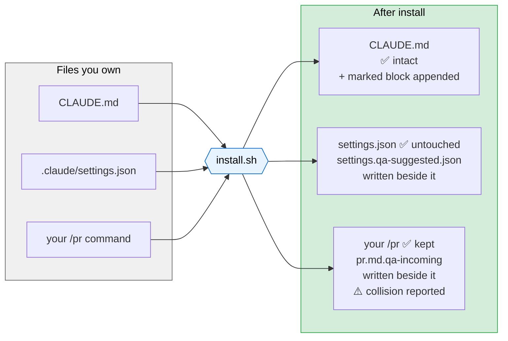
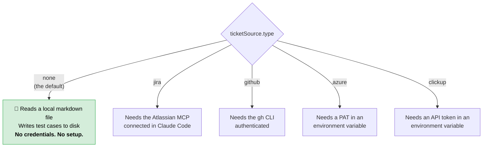
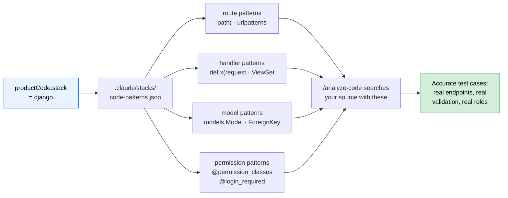
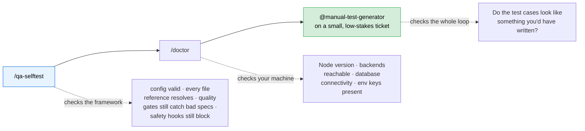
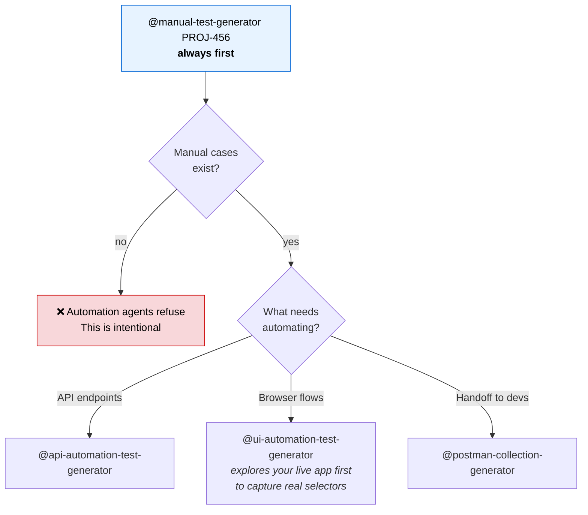
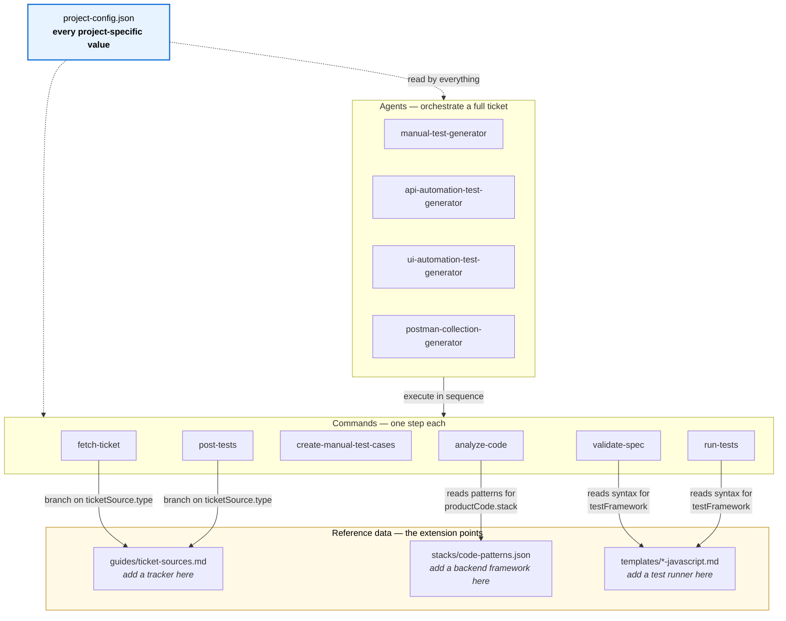

# Setting This Up On Your Project

A runbook for pointing this framework at *your* application, *your* tracker, and *your* test suite.

Nothing here requires you to understand how the AI works. You are filling in a form — one
configuration file — and then verifying it took effect. Total time is **20–40 minutes** for an
existing test suite, or about **15 minutes** if you are starting from nothing and let the
scaffolder do the work.

> **The one rule that saves you pain later:** you edit **configuration**, never the framework's own
> files. Every value this framework needs about your project lives in
> `.claude/project-config.json`. If you find yourself editing a file under `.claude/commands/` or
> `.claude/agents/`, stop — there is a config field for it, and hand-edits are lost the next time
> you upgrade.

---

## Which path are you on?

```mermaid
flowchart TD
    START(["Start here"]) --> Q1{"Do you already have<br/>a test suite?"}

    Q1 -->|"No — starting fresh"| FRESH["Install, then run /qa-init<br/>It interviews you and scaffolds<br/>the whole folder structure"]
    Q1 -->|"Yes — existing suite"| EXIST["Install, then map the config<br/>to your real folder layout"]

Copy the `.claude/` folder and the docs into your test repo (this repo ships only the framework — the `cypress/` tree below is not included; `/qa-init` scaffolds it, or your existing suite provides it). The structure you'll end up with:

    EXIST --> STEPS["Steps 1 → 8 below"]
    STEPS --> VERIFY{"/qa-selftest<br/>all green?"}
    VERIFY -->|"No"| FIX["/qa-help tells you<br/>exactly what is missing"]
    FIX --> VERIFY
    VERIFY -->|"Yes"| DONE(["First real run"])

    style DEMO fill:#e7f3ff,stroke:#0366d6,color:#000
    style VERIFY fill:#fff3cd,stroke:#b8860b,color:#000
    style DONE fill:#d4edda,stroke:#28a745,color:#000
```

**If you get lost at any point, run `/qa-help`.** It reads your actual setup state and prints a
personalised checklist of what to do next. It is not a documentation dump — it inspects real files.

---

## Step 1 — Install · *2 minutes*

**What you're doing:** copying the framework into your test repository without disturbing anything
already there.

```bash
git clone https://github.com/NitinTech9/QAAIAgentsTrio.git
cd QAAIAgentsTrio

./install.sh --target /path/to/your-test-repo --dry-run   # preview — writes nothing
./install.sh --target /path/to/your-test-repo             # do it
```

**Do not copy `.claude/` by hand.** Your repository may already have a `CLAUDE.md`, its own
`.claude/settings.json`, or slash commands whose names clash with the framework's. A manual copy
silently destroys them. The installer does not.

**What the installer guarantees:**



Re-running is safe and idempotent. `--force` replaces conflicts and backs up the originals to
`.claude/.qa-backup-<timestamp>/` first.

**Verify:** the installer prints a file count and any collisions. If it reported name collisions,
rename one side before you start using the pipeline — otherwise Claude Code sees two commands with
the same name and may pick either.

**Starting from nothing?** Stop here and run `/qa-init`. It interviews you (Cypress, or Playwright —
**experimental**: the Playwright path is translated per-run from Cypress-oriented instructions and
is not covered by `/qa-selftest`; one backend or two, database access, tracker) and writes the
folder structure *and* the config for you. Then skip to **Step 7**.

---

## Step 2 — Choose your ticket source · *5 minutes*

**What you're doing:** telling the framework where tickets come from and where finished test cases
should go.



### Start with `none`

This is not a downgrade — it is the fastest way to find out whether the framework produces test
cases you'd actually accept, before you spend time on credentials. Write a ticket as a markdown
file, run the pipeline, read the output.

```markdown
<!-- docs/test-cases/LOCAL-1.md -->
# Summary
Users can cancel a subscription from the account page

## Description
A cancel button appears for active subscriptions only...

## Acceptance Criteria
- Cancelling sets status to `cancelled` and records the timestamp
- Already-cancelled subscriptions return a 409
```

Then: `@manual-test-generator LOCAL-1`

### Then connect your real tracker

```jsonc
"ticketSource": {
  "type": "jira",                          // none | jira | github | azure | clickup
  "none":   { "outputDir": "docs/test-cases" },
  "jira":   { "cloudId": "your-org.atlassian.net", "testIssueType": "Test",
              "issueLinkType": "Test", "batchSize": 8, "testAssigneeAccountId": null },
  "github": { "repo": "owner/repo", "testLabel": "test-case" },
  "azure":  { "organization": "your-org", "project": "your-project",
              "testWorkItemType": "Test Case", "tokenEnvVar": "AZURE_DEVOPS_PAT" },
  "clickup": { "listId": "000000000", "tokenEnvVar": "CLICKUP_TOKEN" }
}
```

Only the block for your chosen `type` needs to be correct — leave the rest as shipped.

| Source | What you need | Where to find the ID |
|---|---|---|
| `jira` | Atlassian MCP connected in Claude Code | `cloudId` is in any issue URL: `https://`**`cloudId`**`/browse/PROJ-123` |
| `github` | `gh` installed, `gh auth status` clean | `repo` is just `owner/name` |
| `azure` | A Personal Access Token with *Work Items: Read & Write* | Organisation and project names are in your Azure DevOps URL |
| `clickup` | An API token | `listId` is in the list URL |

> ⚠️ **`tokenEnvVar` is the *name* of an environment variable — never the token itself.**
> Write `"AZURE_DEVOPS_PAT"`, not the secret. A literal secret there is a hard `/qa-selftest`
> failure, because this file gets committed and shared.

**Ticket ID shapes differ by source** and the framework validates against the right one
automatically: `PROJ-1234` for Jira, `#412` for GitHub, `88213` for Azure.

**Extending this:** to add a tracker, add a section to `.claude/guides/ticket-sources.md` and an
enum value to the schema. Never create per-source command files — that duplicates ~90% identical
logic and is exactly what this design avoids.

---

## Step 3 — Map the paths to your layout · *5 minutes*

**What you're doing:** telling the framework where things live in *your* repository. The agents
never assume a folder layout — they read every path from here.

```jsonc
"paths": {
  "ticketContext": "docs/.ticket-context",   // agent working notes and checkpoints
  "manualCases":   "docs/test-cases",        // human-readable test cases
  "apiTests":      "cypress/e2e/API",        // generated API specs land here
  "uiTests":       "cypress/e2e/UI",         // generated UI specs land here
  "jiraTicketTests": "cypress/e2e/JiraTicket", // regression specs tied to a bug ticket
  "pages":         "cypress/e2e/pages",      // Page Objects for UI tests
  "support":       "cypress/support/commands.js",  // your custom commands
  "dataFactory":   "cypress/support/dataFactory.js",
  "tasks":         "cypress/tasks",          // database helpers
  "fixtures":      "cypress/fixtures",
  "knowledge":     "cypress/knowledge",      // the accumulated-knowledge files
  "swaggerPrimary": "cypress/fixtures/swagger.json",
  "reports":       "cypress/reports"
}
```

Using `tests/` instead of `cypress/`? Change the values here and nothing else. Optional entries you
don't have can be `null`.

Also set, at the top level:

| Field | Meaning |
|---|---|
| `name` | Your project's name — used in generated file headers |
| `testFramework` | `cypress` or `playwright`. Selects the syntax fact sheet in `.claude/templates/` |
| `dbVerification` | `true` if your suite can query the database. Set `false` and the "must assert persistence" gate is relaxed — a deliberate, documented downgrade |

---

## Step 4 — Auth and application URLs · *5 minutes*

**What you're doing:** teaching the framework how a test logs in, and where the app lives.

```jsonc
"auth": {
  "primary": {
    "loginCommand": "cy.loginAndGetSessionCookie()",
    "sessionCookieAlias": "@sessionCookie",
    "csrfTokenAlias": "@csrfToken"
  },
  "secondary": null            // only if your suite tests a second backend
},
"app": {
  "primaryBaseUrl": "http://localhost:4000",
  "secondaryBaseUrl": null,
  "loginPath": "/login",
  "envFile": "cypress.env.json",   // git-ignored; holds the credentials
  "emailKey": "LOGIN_EMAIL",
  "passwordKey": "LOGIN_PASSWORD"
}
```

| Your auth style | What to set |
|---|---|
| Session cookie | Keep the shape above, change the command name |
| Bearer token | Point `loginCommand` at your token-generating command, update the aliases |
| None | `"loginCommand": null` — generated specs skip auth setup entirely |
| Two backends | Fill in the `secondary` block and `secondaryBaseUrl`; leave `null` otherwise |

**The login command must actually exist in your suite.** The config only names it. If it doesn't
exist yet, add it:

```javascript
// cypress/support/commands.js
Cypress.Commands.add('loginAndGetSessionCookie', () => {
  cy.request('POST', '/api/auth/login', {
    username: Cypress.env('LOGIN_EMAIL'),
    password: Cypress.env('LOGIN_PASSWORD')
  }).then((resp) => {
    cy.wrap(resp.headers['set-cookie']).as('sessionCookie');
    cy.wrap(resp.body.csrfToken).as('csrfToken');
  });
});
```

Credentials go in `cypress.env.json`, which is git-ignored. Never in the config.

---

## Step 5 — Tell it your backend framework · *1 minute, and it matters*

**What you're doing:** choosing which search patterns are used to find routes, request handlers,
data models, and permission checks in your source code.

```jsonc
"productCode": {
  "stack": "django"    // go-chi | go-gin | express | nestjs | django | fastapi
                       // | rails | spring-boot | laravel | dotnet | generic
}
```

**This is not optional.** The shipped default is `generic`, which is deliberately broad and
produces noisy, low-confidence analysis. `/analyze-code` will warn you when it is in use — but a
wrong or unset stack means *silently mediocre* test cases, which is far worse than an error you can
see.



Two ways to extend, neither of which touches a command file:

**Your framework isn't listed** — add a key to `.claude/stacks/code-patterns.json`. It is shared
with your team and survives upgrades.

**You have in-house route helpers** the presets can't know about — override just that field:

```jsonc
"codePatterns": { "route": ["registerInternalRoute", "mountApi\\("] }
```

A non-empty array *replaces* that field of the preset; an empty one inherits it.

> **Never add patterns by editing `.claude/commands/analyze-code.md`.** Your change is lost on the
> next upgrade, and `/qa-selftest` deliberately fails the framework if stack-specific patterns
> reappear in that file.

---

## Step 6 — Your machine's paths · *3 minutes*

**What you're doing:** separating "things true for the whole team" from "things true only on your
laptop". Absolute paths are always the second kind.

```bash
cp .claude/project-config.local.example.json .claude/project-config.local.json
cp .claude/settings.local.example.json       .claude/settings.local.json
```

Both are git-ignored. In the first, set the paths to your locally cloned application repositories:

```jsonc
"productCode": {
  "rootPaths": ["/Users/you/code/your-backend", "/Users/you/code/your-frontend"]
}
```

In the second, list the same paths under `permissions.additionalDirectories` so Claude Code is
allowed to read them, plus any `deny` rules for sensitive files inside those repositories.

> **Do not edit the shared `.claude/settings.json`.** It ships working defaults — the two safety
> hooks and deny rules valid in every clone — with no machine-specific paths in it. Editing it
> guarantees a merge conflict on every upgrade.

**Everything the agents do to your application repositories is read-only.** That is enforced by
instruction *and* by permission rules; they may only read, search, and list.

---

## Step 7 — Verify before you trust it · *5 minutes*

Three checks, in order. Do not skip to a real ticket.



**`/qa-selftest`** is a regression suite for the framework itself. It runs entirely offline against
bundled fixtures — no tracker, no browser, no backend. It verifies your config, that every file the
commands reference actually exists, that the quality gates still reject a known-bad spec and accept
a known-good one, and that both safety hooks still block what they are supposed to block. Run it
after every install and every upgrade. (`quick` runs only the deterministic phases.)

**Pick a small ticket for the first real run** — a bug with narrow scope beats a large story. You
are evaluating the *output quality*, and it is much easier to judge on something small.

### You're done when

- [ ] `/qa-selftest` reports all green
- [ ] `/doctor` shows no blockers
- [ ] `ticketSource.type` is set, and its credential requirement is satisfied
- [ ] `productCode.stack` is your real backend framework, not `generic`
- [ ] `productCode.rootPaths` is set in `project-config.local.json`
- [ ] Your `loginCommand` exists in your suite and works
- [ ] One ticket has produced manual test cases you would have signed off yourself

---

## Step 8 — Your first real run

```bash
@manual-test-generator PROJ-456
```

Manual test cases come first, always. The automation agents refuse to run without them — that is a
deliberate hard gate, because automation written without an agreed human-readable definition of
"correct" is just code that passes.



Full detail on every agent, command, and flag: **[AI-AUTOMATION-GUIDE.md](AI-AUTOMATION-GUIDE.md)**.

---

## Configuration reference

The remaining fields, for when you need them.

### Test volume

```jsonc
"testLimits": { "bugMaxTests": 2, "storyMaxTests": 8 }
```

Per **spec file**. Bugs get few, focused tests — a reproduction, not a survey. Stories get more.
Tickets that span several layers produce several spec files rather than dropping coverage.

### Run commands

```jsonc
"runCommand": {
  "headed":   "npx cypress run --spec \"{specFile}\" --headed --reporter mochawesome",
  "headless": "npx cypress run --spec \"{specFile}\" --reporter mochawesome",
  "withEnv":  "CYPRESS_ENV={env} npx cypress run --spec \"{specFile}\" --reporter mochawesome"
},
"runTimeoutMs": 600000
```

`{specFile}` and `{env}` are substituted at run time. If your machine needs a prefix — a Node
version manager, for instance — add it to all three.

### Code analysis scope

```jsonc
"productCode": {
  "sourceGlobs": [],                  // empty = inherit from the stack preset
  "excludeDirs": ["node_modules", ".git", "dist", "build", "coverage", "vendor"]
}
```

### Postman (optional)

```jsonc
"postman": {
  "collectionsPath": "postman/collections",
  "authType": "cookie",               // cookie | bearer | none
  "loginEndpoint": "/session",
  "csrfEndpoint": "/api/session"
}
```

Describe your real auth flow here so generated collections model it correctly. Leave as-is if you
don't use Postman — that agent simply never runs.

---

## Upgrading later

The installer records `.claude/.qa-framework-manifest.json` with the version and the exact file
list it wrote. To take a newer version:

```bash
cd QAAIAgentsTrio && git pull
./install.sh --target /path/to/your-test-repo --dry-run   # see what changed
./install.sh --target /path/to/your-test-repo
/qa-selftest                                             # confirm nothing broke
```

Files that differ are written as `.qa-incoming` sidecars for you to diff rather than being
overwritten. **This stays painless only if you kept every project-specific value in config.** Every
framework file you hand-edited becomes a manual merge, every single upgrade — which is why the rule
at the top of this document is the rule at the top of this document.

---

## When something doesn't work

| Symptom | Cause | Fix |
|---|---|---|
| *"Manual test cases do not exist"* | An automation agent ran before `@manual-test-generator` | Run the manual generator first. This gate is intentional. |
| *"Pipeline step already done — skipping"* | The step is checkpointed as complete | That's the resume feature. Append `force` to regenerate from scratch. |
| *"No product source code paths configured"* | `productCode.rootPaths` is empty | Set it in `project-config.local.json` (Step 6). |
| Analysis finds no endpoints, or the wrong ones | `productCode.stack` is `generic` or wrong | Set your real backend framework (Step 5). |
| UI tests use selectors that don't exist | Browser MCP not connected, so live exploration was skipped | Connect `claude-in-chrome` and ensure the app is running. |
| Tracker writes fail with an auth error | The credential for your `ticketSource.type` isn't available | Jira → connect the MCP · GitHub → `gh auth login` · Azure/ClickUp → export the token variable |
| A command is blocked unexpectedly | A safety hook fired | Read the message — it names the pattern. Production targets and destructive git are blocked by design. |
| Two commands with the same name | A name collision the installer warned about | Rename one side. |
| Something else entirely | — | Run `/qa-help` — it inspects real state and tells you your next step. |

---

## How it fits together

For when you need to change the framework rather than configure it.



### The four agents

| Agent | What it does | Depends on |
|---|---|---|
| `manual-test-generator` | Ticket → human-readable test cases → posted to the tracker | Nothing. Run this first. |
| `api-automation-test-generator` | Manual cases → API spec → validated → executed → results posted | Manual cases must exist |
| `ui-automation-test-generator` | Explores your live app for real selectors → UI spec → validated → executed | Manual cases + browser MCP |
| `postman-collection-generator` | Ticket context → importable Postman collection | Manual cases must exist |

### Design principles worth knowing before you change anything

1. **Manual-first hard gate** — automation agents refuse to run without agreed manual test cases.
2. **Checkpointed steps** — every step records completion, so an interrupted run resumes instead of
   restarting.
3. **Idempotent tracker writes** — a ledger prevents duplicate test issues on rerun.
4. **Human approval gates** — before any tracker write, and before executing tests.
5. **Config-driven, always** — no hardcoded paths, URLs, credentials, or framework patterns
   anywhere in the agents or commands.
6. **One place per concern** — trackers in one guide, code patterns in one preset file, test-runner
   syntax in one fact sheet. Adding a variant means one new entry, never a new command file.
