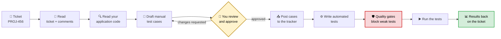
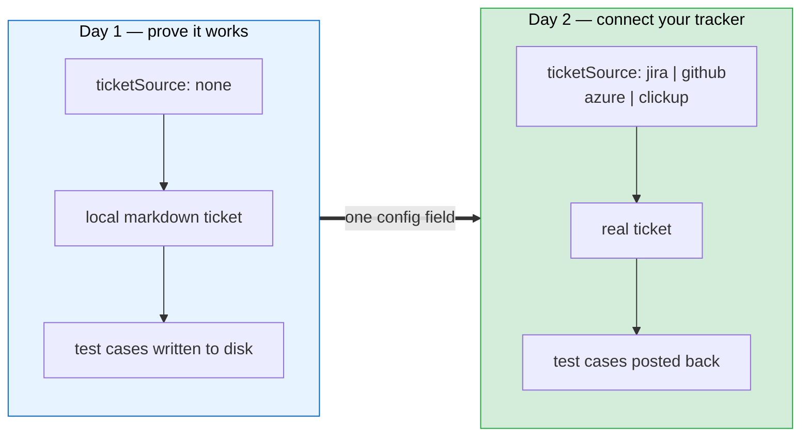
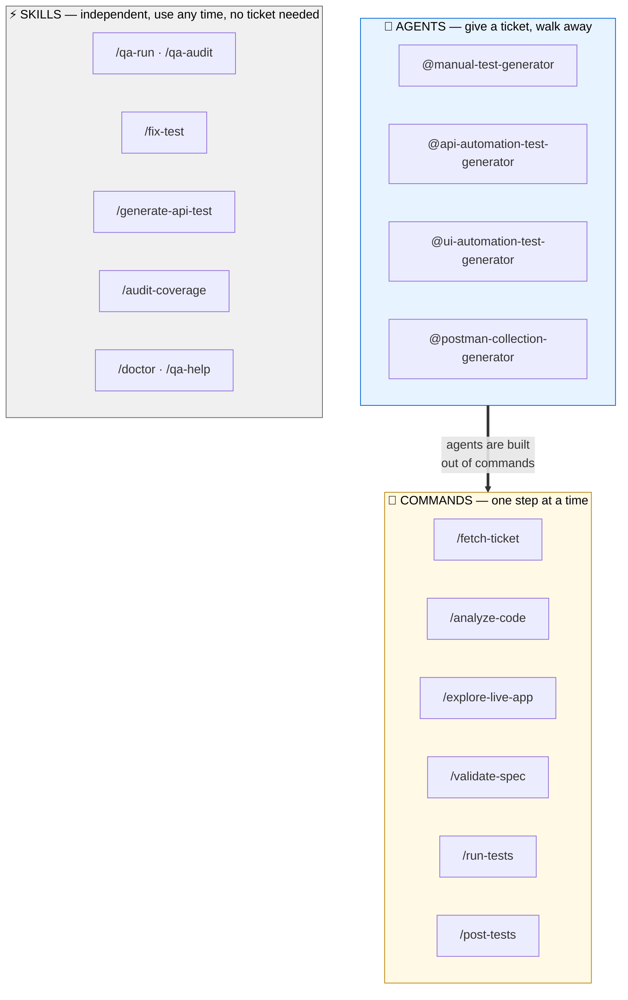

# QA AI Agents Trio

**Turn a ticket into reviewed test cases and running automated tests — without leaving your editor.**

You give it a ticket number. It reads the ticket, reads your application's source code, writes the
test cases a human would have written, shows them to you for approval, then writes and runs the
automated tests — and reports the results back on the ticket.

It is not a code generator you paste from. It is a set of instructions that drives Claude Code
through the same sequence a senior QA engineer follows, with the same stopping points for human
judgement.

---

## The 60-second version



Two boxes matter more than the rest:

- **You review and approve** (yellow) — nothing is written to your tracker until a human says yes.
- **Quality gates** (red) — generated tests are mechanically checked and *rejected* if they are the
  kind of test that can't fail. More on this below, because it is the difference between real
  coverage and the illusion of it.

---

## Why this exists

AI writes plausible tests very quickly. Plausible is the problem.

| The usual failure | What this framework does about it |
|---|---|
| Tests assert on invented UI selectors that don't exist on the page | Opens your app in a real browser and captures the **actual** selectors before writing a line |
| Tests written from the ticket alone, missing validation rules the code enforces | Reads your source code and treats it as the source of truth, not the ticket description |
| A test asserts "status is 200 **or** 400" — it can never fail, so it proves nothing | A gate **blocks** ambiguous assertions and any test that accepts a 5xx error |
| A "create" test passes without ever checking the record was saved | A gate **requires** a database assertion on every create/update/delete |
| The same known-broken endpoint gets re-diagnosed every sprint | Keeps a written record of known bugs, quirks, and past failures, and consults it first |
| Half-finished runs have to start over | Every step is checkpointed — rerun the same command and it resumes where it stopped |

The last two are the compounding part: the longer a team uses it, the more your suite's hard-won
knowledge is written down where the next run will actually read it.

---

## Install

```bash
git clone https://github.com/NitinTech9/QAAIAgentsTrio.git
cd QAAIAgentsTrio

./install.sh --target /path/to/your-test-repo --dry-run   # preview — writes nothing
./install.sh --target /path/to/your-test-repo             # install
```

**The installer will not damage your repository.** That is a design guarantee, not a hope:

| Your existing file | What happens to it |
|---|---|
| `CLAUDE.md` | Left intact. A clearly marked block is **appended**, and refreshed in place on upgrade. |
| `.claude/settings.json` | **Never written.** Ours is dropped beside it as `settings.qa-suggested.json` for you to merge. |
| A command with the same name as ours | **Never overwritten.** Ours lands as `<file>.qa-incoming` for you to diff, and the collision is reported. |
| Anything else that differs | Same — `.qa-incoming` sidecar, never a silent overwrite. |

Re-running the installer is safe. `--force` will replace conflicts, and backs up the originals
first. A manifest is recorded so future versions can be upgraded rather than hand-merged.

### Start with zero integrations

You do **not** need Jira, credentials, or any connected service to see this work. `ticketSource`
ships as `none`: write a ticket as a local markdown file and the entire pipeline runs offline,
saving test cases to disk. Point it at a real tracker once you trust it.



---

## What you get

Three kinds of tool, for three different situations.



| | Use it when | Example |
|---|---|---|
| **Agents** | You have a ticket and want the whole job done | `@manual-test-generator PROJ-456` |
| **Commands** | You want to redo or inspect one specific step | `/validate-spec PROJ-456 api` |
| **Skills** | No ticket — a test is failing, or you want a health check | `/fix-test`, `/qa-audit` |

**Never used this before?** Two commands are built for exactly that moment:

- `/qa-init demo` — a complete sandbox against a public API. No backend, no tracker, no
  credentials. Watch the full pipeline run end to end in about ten minutes.
- `/qa-help` — inspects your actual setup and prints a personalised *"here is your next step"*
  checklist. Use it whenever you're unsure what to do.

---

## Is this safe to point at my project?

The honest answer to the questions people actually ask.

| Question | Answer |
|---|---|
| **Can it run tests against production?** | It is designed to refuse. A guard inspects every command before it runs and blocks production environment variables and any URL matching your configured production patterns. |
| **Can it change my application's source code?** | No. Your product repositories are opened **read-only**. The agents may only read, search, and list files there — writing is prohibited by instruction and by permission rules. |
| **Can it read my secrets?** | Files matching `.env`, `credentials*`, `secrets.*`, private keys and similar are denied outright, and a second guard blocks any attempt to *write* them. |
| **Will it commit or push without asking?** | No. Destructive git commands are blocked and must be run by a human. |
| **Does anything get posted to my tracker automatically?** | Not without approval. Agents stop, show you the full list of test cases, and wait. Unattended runs are opt-in via an explicit flag. |
| **Is my code uploaded anywhere?** | Only to the AI model you have already chosen to use with Claude Code. This framework adds no services, no telemetry, and no external calls of its own. |

These are enforced by two small scripts in `.claude/hooks/`, wired into Claude Code's tool
permission system — not by politely asking the AI to behave. `/qa-selftest` smoke-tests both of
them and fails the framework if either stops blocking.

---

## What's inside

```
install.sh                      # non-destructive installer — start here
VERSION                         # framework version, recorded into every install

.claude/
  agents/            4 agents      end-to-end pipelines for one ticket
  commands/          18 commands   individual pipeline steps
  skills/             9 skills     ad-hoc tools that need no ticket
  guides/            reference     how each ticket tracker is read and written
  stacks/            presets       code-search patterns for 10 backend frameworks
  templates/         fact sheets   Cypress and Playwright syntax conventions
  hooks/             2 scripts     the production and secret-safety guards
  schemas/           validation    the config schema, checked by your editor
  selftest/          fixtures      offline test data for /qa-selftest

  project-config.json             ⚠️ the one file you must edit
  settings.json                   shared permissions + hooks — do not edit
  settings.local.example.json     your machine's paths go here (git-ignored)
```

---

## Where to go next

| You want to… | Read |
|---|---|
| **Set this up on your project** | [HOW-TO-ADAPT.md](HOW-TO-ADAPT.md) — a step-by-step runbook with time estimates |
| **Understand what each agent and command does** | [AI-AUTOMATION-GUIDE.md](AI-AUTOMATION-GUIDE.md) — the full reference |
| **Just see it work first** | Run `/qa-init demo` |
| **Check the framework itself is healthy** | Run `/qa-selftest` |

### Requirements

| Required | For |
|---|---|
| Claude Code (VS Code extension or `claude` CLI) | Everything — this is where you type commands |
| Node.js and your test runner (Cypress or Playwright) | Running the generated tests |
| Your application's source code, cloned locally | Code analysis (optional but strongly recommended) |
| A tracker connection — Jira MCP, `gh`, or an API token | Only if `ticketSource` is not `none` |
| Browser access via the `claude-in-chrome` MCP | Only for UI test generation |

### Continuous integration

Copy `ci/qa-pr-gate.example.yml` into `.github/workflows/` for a ready-made pull request gate that
runs your `@PR`-tagged tests and uploads the report. For scheduled or unattended runs, every agent
accepts `auto` (no prompts; tracker writes skipped, drafts saved locally) and `auto-post` (allow
the tracker writes too).

### Good to know

- Test frameworks: **Cypress + JavaScript** (battle-tested — the path everything is verified against)
  and **Playwright + JavaScript** (**experimental** — generation relies on per-run translation of
  Cypress-oriented instructions and is not exercised by `/qa-selftest`; review its output more
  carefully). Selected by `project.testFramework`. Adding another framework means writing one fact
  sheet in `.claude/templates/`.
- No credentials live in this repository. Tests read them from your own git-ignored environment
  file.
- Machine-specific paths belong in `project-config.local.json` and `settings.local.json` — both
  git-ignored — never in the shared config.

---

Maintained by Nitin Pathak · nitin.pathak@tech9.com
